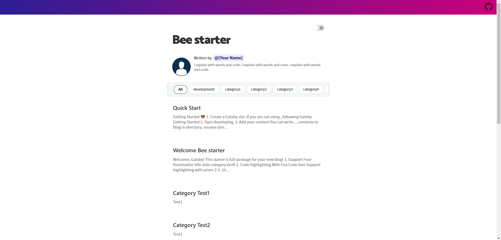

# 목차

# github.io 블로그를 제작하게 된 이유

프로그래밍을 시작하고 대학에서 들어가 공부하면서 이것저것 건드려 본 것은 많지만 지금까지 내가 남겨놓은 발자취들이 별로 없다는 것을 깨닫게 되었다.

그래서 틈틈이 하던 개발이든 관심있는 분야인 인공지능이든 뭐든지간에 내가 보고 듣고 배워가는 과정을 블로그에 담아두면 어떨까 하는 생각이 들었다.

다른 블로그도 많지만 굳이 github.io를 선택한 이유는 지인에게 [Gatsby](https://www.gatsbyjs.com/)라는 정적 사이트 Generator를 추천받았기 때문이다. 마침 JavaScript와 친해질 기회를 노리고 있었는데 좋은 타이밍이라는 생각이 들었다.

# 블로그 테마 탐색

웹개발 뉴비인 나에게는 밑바닥부터 시작하는 블로그 개발은 엄청난 부담으로 다가올 것이 명확하기에 다른 전문가들이 만들어 놓은 기반들을 잘 사용하기로 했다.

그렇게 인터넷을 뒤지던 도중 찾은 것이 바로 이 테마이다.

◊ ["Gatsby-starter-bee"](https://github.com/JaeYeopHan/gatsby-starter-bee) Theme


단순하면서도 블로그의 기능은 다 갖추었다는 디자인이라는 생각이 들어 바로 선택하게 되었다.

# 시행착오

테마도 찾았고 이제 나만의 블로그를 맞이할 준비만 남겨놓고 있던 나는 시작부터 문제를 마주치게 되었다.

```
gatsby new blog_v1 https://github.com/JaeYeopHan/gatsby-starter-bee
```

gatsby도 깔고 모든 환경이 갖추어져 있던 상태에서 이 코드만 치면 블로그가 만들어질텐데 내 컴퓨터는 에러만 내뱉을 뿐이었다.


구글링으로도 문제점을 찾지 못해 어떻게 해야하나 고심하던 도중 해당 테마 깃허브의 Issue 페이지를 탐색하게 되었다.

그곳에서 내가 처한 상황과 아주 유사한 문제로 [포스트](https://github.com/JaeYeopHan/gatsby-starter-bee/issues/316)를 올린 사람이 있었는데, 여기에 답글로 달린 해결방법은 바로 **node 버전을 낮추는 것**이었다.

나는 node를 최근에 이 컴퓨터에 설치하여 18.xx 버전이었는데, 해결방법대로 14.xx 버전으로 낮추어서 다시 시도했더니



고생끝에 성공적으로 Demo 페이지를 만날 수 있었다.

# 블로그 빌드

지금까지의 작업으로 로컬에서 블로그를 작동시키는데 성공했다면 이제는 github.io에서 작동이 될 수 있도록 설정해주는 작업을 해야한다.

깃허브 페이지를 deploy하기 위해 gh-pages라는 패키지를 이용해야 하는데, 몇가지 과정들이 필요하다.


먼저 자신의 깃허브에 **"자신의 깃허브 이름.github.io"** 라는 repository를 만든 후, 자신의 블로그 코드를 commit 한다.
github.io에 deploy 하는 용도의 'deploy' 브랜치를 만든다.

```
"scripts": {
    "deploy": "gatsby build && gh-pages -d public -b deploy"
}
```

그리고 위와 같은 코드를 package.json 코드에 삽입해 deploy 명령어를 통해서 gh-pages로 'deploy' 브랜치에 배포할 수 있도록 한다.

이런 과정을 거치면 몇분 뒤 **"자신의 깃허브 이름.github.io"** 로 접속하였을 때 블로그 첫 페이지를 볼 수 있을 것이다.
