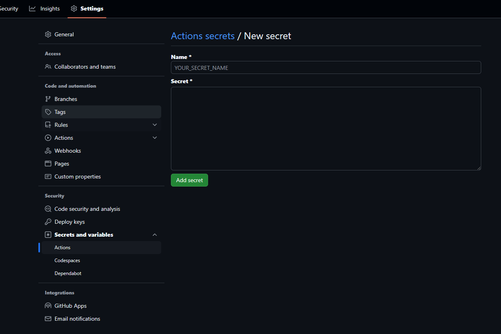

# 목차

# 우리 서버가 많이 아파요
현재 진행중인 프로젝트에서 백엔드 스프링 부트 서버는 내 오라클 클라우드 개인 서버에서 Docker Compose를 이용해 배포를 하는 중이다.

내 서버가 4코어 CPU에 24GB 램이라는 아주 여유로운 사양을 가지고 있는 서버라서 지금까지 배포에는 아무런 문제도 없었지만, PM과 최종 Production 배포 환경을 구상해보니 금액면에서 사양이 매우 낮은 서버를 사용할 수 밖에 없게 되었다... 😭
해당 서버의 사양이 Docker의 최소사양은 간신히 넘기긴 하는데 말그대로 **최소**사양이라 상황에 따라 Production에 큰 영향을 줄 수 있을거라고 판단했고, Docker를 이용한 마이크로서비스 배포는 포기하게 되었다.

그리고 현재로서는 빌드를 수행하는 곳이 실제 배포가 되는 서버인데, 앞으로 변경될 서버는 낮은 사양으로 인해 정상적인 빌드를 수행하기 힘들 것이기 때문에 Github Actions의 서버에서 빌드를 수행하는 방식으로 변경해야 했다.

따라서 Github Actions 배포 설정을 전체적으로 변경하게 되었다.

# 배포 설정 변경하기
이전 설정 파일은 아래와 같다.
```yml
name: Auto Deploy with Docker Compose

on:
  push:
    branches:
      - main

jobs:
  deploy:
    runs-on: ubuntu-latest

    steps:
      - name: Execute remote SSH commands
        uses: appleboy/ssh-action@v1.0.3
        with:
          host: ${{ secrets.SSH_HOST }}
          username: ${{ secrets.SSH_USER }}
          key: ${{ secrets.SSH_KEY }}
          port: ${{ secrets.SSH_PORT }}
          script: |
            cd ${{ secrets.PROJECT_PATH }}
            docker compose down
            git pull origin main
            docker compose up -d --build
```

배포 서버에 SSH로 접근한 뒤 기존 Docker Compose로 올린 스프링 부트 서버 컨테이너와 DB 서버 컨테이너를 전부 내리고 `git pull` 로 코드를 업데이트 한뒤 image를 빌드하여 다시 올리는 작업을 수행했다.

## checkout 수행
Github Actions 서버에서 빌드를 수행할 것이므로 해당 서버에 레포지토리의 소스코드를 전달해야 한다.
이 작업은 Github에서 공식적으로 제공하는 `checkout` 액션을 사용해 쉽게 설정 가능하다.
```yml
    steps:
      - name: Checkout code
        uses: actions/checkout@v4
```

## application.properties 옮기기
현재 프로젝트에서는 DB 연결 정보나 JWT secret key같은 secret한 정보를 담고 있는 application.properties 설정 파일을 따로 분리해 관리하고 있는데, 이것들은 gitignore 처리가 되었기 때문에 checkout 액션으로 서버에 넣어줄 수가 없다.
따라서 Github 레포의 설정에서 Github Action에 사용되는 secrets를 생성해 분리된 application.properties 설정 파일 내용을 저장하고, 저장된 secrets를 `echo` 명령어를 통해 파일로 저장해 지정된 경로에 넣어야 했다.
secrets는 Github 레포 페이지의 Settings > Secrets and variables > Actions 메뉴에서 생성하고 관리할 수 있다.

이 secrets는 한번 저장하면 내용을 확인할 수 없고 수정을 하려고 해도 원본 내용이 보이지 않기 때문에 굉장히 안전해 보인다.

```yml
    steps:
      - name: Add application properties files
        run: |
          echo "${{ secrets.PRODUCTION_PROPERTIES }}" > ./src/main/resources/application-prod.properties
          echo "${{ secrets.SECRET_PROPERTIES }}" > ./src/main/resources/application-secret.properties
```

## JDK 설정 및 빌드 수행
이제 모든 소스코드가 서버에 올라갔으므로 빌드를 수행할 차례이다.
먼저 빌드를 수행할 수 있는 환경을 구성하기 위해 **JDK**를 setup 해야 한다. 이것 역시 Github에서 제공하는 `setup-java` 액션을 사용해 쉽게 설정 가능하다.

```yml
    steps:
      - name: Set up JDK
        uses: actions/setup-java@v4
        with:
          distribution: 'corretto'
          java-version: '17'
```

본 프로젝트의 스프링 부트는 Gradle을 사용하고 있으므로 gradlew를 이용해 빌드를 진행할 것이다.
빌드를 수행할 gradlew 파일의 접근권한을 설정하고 빌드를 수행한다.

```yml
    steps:
      - name: Grant execute permission for gradlew
        run: chmod +x gradlew

      - name: Build with Gradle
        run: ./gradlew build -x test
```

## 빌드된 jar 파일을 배포 서버에 옮기기
빌드가 끝나면 jar 파일을 생성되는데, 배포를 진행하려면 이 파일을 Github Actions 서버에서 실제 배포할 서버로 옮기는 과정이 필요하다.
이 과정은 `appleboy/scp-action` 액션으로 설정 가능하다. SSH 접속에 필요한 정보들을 secrets에 저장해 넣어주고 Gtihub Actions 서버에서 전달할 파일을 `source` 부분에 적고, 실제 배포할 서버에 어느 경로에 저장할 지를 `target` 부분에 적는다.
이때 `source` 부분에 적힌 경로 전체가 복사되어 전달되는데, 전달할 파일이 여러 폴더 내부에 있을 경우 그 폴더 구조까지 옮겨지기 때문에 jar 파일만 필요한 경우에는 `strip_components` 부분으로 앞의 폴더 구조를 가지치기하는 과정이 필요하다. `strip_components`가 2라는 것은 `source` 부분의 build, libs 폴더의 2 계층을 없앤다는 것이다.

```yml
    steps:
      - name: Copy JAR to Server
        uses: appleboy/scp-action@v0.1.7
        with:
          host: ${{ secrets.SSH_HOST }}
          username: ${{ secrets.SSH_USER }}
          key: ${{ secrets.SSH_KEY }}
          port: ${{ secrets.SSH_PORT }}
          source: ./build/libs/*.jar
          target: ${{ secrets.PROJECT_PATH }}
          strip_components: 2
```

## SSH로 배포 서버에서 jar 파일 실행하기
이전 배포 설정에서도 있었던 부분인데, 이번에는 SSH로 배포 서버에 접속한 후 Docker Compose를 이용하지 않고 `nohup` 명령어로 jar 파일만 실행하도록 만든다.
그리고 스프링 실행으로 발생되는 로그들을 log 파일에 저장되도록 설정하였다.

```yml
    steps:
      - name: Execute remote SSH commands
        uses: appleboy/ssh-action@v1.0.3
        with:
          host: ${{ secrets.SSH_HOST }}
          username: ${{ secrets.SSH_USER }}
          key: ${{ secrets.SSH_KEY }}
          port: ${{ secrets.SSH_PORT }}
          script: |
            cd ${{ secrets.PROJECT_PATH }}
            nohup java -Dspring.profiles.active=prod -jar deploy.jar >> deploy.log 2>&1 &
```
nohup 명령어에서,
- \>\> : 발생한 로그들을 파일에 덮어씌우지 않고 이어서 저장하도록 하기
- 2>&1 : 표준 출력이 전달되는 곳으로 표준 에러를 전달하도록 하기
- & : 백그라운드로 실행되도록 하기

# 전체 yml 코드

```yml
name: Auto Deploy with Docker Compose

on:
  push:
    branches:
      - main

jobs:
  deploy:
    runs-on: ubuntu-latest

    steps:

      - name: Checkout code
        uses: actions/checkout@v4

      - name: Add application properties files
        run: |
          echo "${{ secrets.PRODUCTION_PROPERTIES }}" > ./src/main/resources/application-prod.properties
          echo "${{ secrets.SECRET_PROPERTIES }}" > ./src/main/resources/application-secret.properties

      - name: Set up JDK
        uses: actions/setup-java@v4
        with:
          distribution: 'corretto'
          java-version: '17'

      - name: Grant execute permission for gradlew
        run: chmod +x gradlew

      - name: Build with Gradle
        run: ./gradlew build -x test

      - name: Copy JAR to Server
        uses: appleboy/scp-action@v0.1.7
        with:
          host: ${{ secrets.SSH_HOST }}
          username: ${{ secrets.SSH_USER }}
          key: ${{ secrets.SSH_KEY }}
          port: ${{ secrets.SSH_PORT }}
          source: ./build/libs/*.jar
          target: ${{ secrets.PROJECT_PATH }}
          strip_components: 2

      - name: Execute remote SSH commands
        uses: appleboy/ssh-action@v1.0.3
        with:
          host: ${{ secrets.SSH_HOST }}
          username: ${{ secrets.SSH_USER }}
          key: ${{ secrets.SSH_KEY }}
          port: ${{ secrets.SSH_PORT }}
          script: |
            cd ${{ secrets.PROJECT_PATH }}
            nohup java -Dspring.profiles.active=prod -jar deploy.jar >> deploy.log 2>&1 &
```