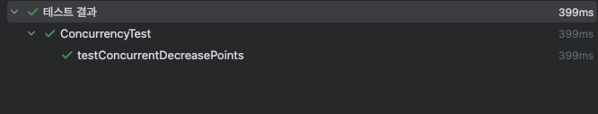
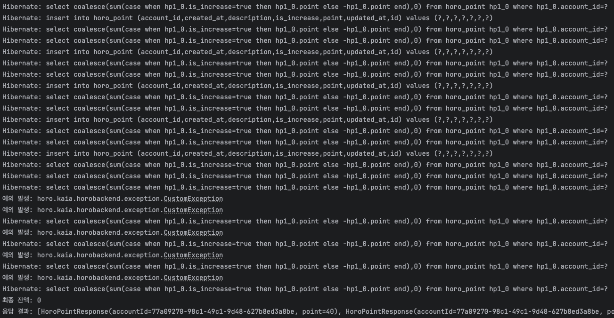

# 목차

# 동시성 이슈 인식

포인트 기능을 구현하다 하나의 커다란 문제를 마주하게 되었다. 바로 동시성 문제였다.

포인트를 차감했을 때 차감 이후 잔액이 0 미만이면 차감이 되지 않도록 만들어야 하는데, 모종의 사유로 여러 개의 차감 요청이 한번에 서버로 전송된다면 잔액이 0 미만임을 제대로 판단하지 못할 것이라는 생각에서 출발했다.

그리고 다음과 같은 테스트 코드로 그 걱정이 틀리지 않았음을 확인할 수 있었다.

```java
@Test
public void testConcurrentDecreasePoints() throws InterruptedException {
    // 초기 테스트 데이터 설정
    Integer initialBalance = 50; // 초기 잔액
    Integer deductAmount = 10; // 차감할 포인트
    String description = "동시성 테스트";

    // 계정 생성 (테스트용)
    Account account = new Account();
    account = accountRepository.save(account);
    String accountId = account.getId();

    // 초기 포인트 기록 생성 (테스트 데이터)
    Point initialPoint = Point.builder()
            .account(account)
            .isIncrease(true)
            .point(initialBalance)
            .description("초기 포인트")
            .build();
    pointRepository.save(initialPoint);

    // 스레드 풀 생성 (10개의 스레드)
    ExecutorService executorService = Executors.newFixedThreadPool(10);

    // 결과 저장 리스트
    List<PointResponse> responses = new ArrayList<>();

    for (int i = 0; i < 10; i++) {
        executorService.submit(() -> {
            try {
                DecreasePointRequest request = new DecreasePointRequest(accountId, deductAmount, description);
                PointResponse response = pointService.decreasePoint(request);
                synchronized (responses) {
                    responses.add(response); // 결과 저장
                }
            } catch (Exception e) {
                System.out.println("예외 발생: " + e);
            }
        });
    }

    // 스레드 풀 종료 및 대기
    executorService.shutdown();
    executorService.awaitTermination(30, TimeUnit.SECONDS);

    // 최종 잔액 계산 및 검증
    Integer finalBalance = pointRepository.findPointBalanceByAccountId(account.getId());
    System.out.println("최종 잔액: " + finalBalance);

    // 잔액은 0 미만으로 줄어들면 안됨
    assertEquals(0, finalBalance);

    System.out.println("응답 결과: " + responses);
}
```

10개의 스레드를 만들어 동시에 차감 요청을 시도하였고 그 중에 5개만 포인트 차감이 반영되어야 하는 테스트인데, 보란듯이 잔액이 -50이 되면서 테스트에 실패하였다.

따라서 동시성 문제가 발생하고 있다는 것을 확인하였고, 여러 해결 방법 중에 “비관적 Lock”을 고르게 되었다.

포인트가 많이 사용되는 앱의 코드이므로 포인트 감소가 동시에 일어날 가능성도 꽤 있을 것이고, 포인트는 민감한 부분이기 때문에 시간이 걸리더라도 확실하게 처리하는 게 중요하다고 생각했기 때문이다. 구현이 비교적 간단하다는 장점도 추가로 있다.

# 비관적 Lock 적용

```java
@Lock(LockModeType.PESSIMISTIC_WRITE)
@Query("SELECT hp FROM Point hp WHERE hp.account.id = :accountId")
List<Point> findAllByAccountIdWithLock(@Param("accountId") String accountId);
```

비관적 Lock을 적용하기 위해 Lock을 획득할 수 있는 Repository 메서드를 만들었다.

Lock 어노테이션에 PESSIMISTIC_WRITE로 비관적 Lock을 쉽게 적용할 수 있다.

```java
public PointResponse decreasePoint(DecreasePointRequest decreasePointRequest) {
	  String accountId = decreasePointRequest.getAccountId();
	  Integer point = decreasePointRequest.getPoint();
	  String description = decreasePointRequest.getDescription();
	
	  Account account = accountRepository.findById(accountId).orElseThrow(() ->
	          new CustomException(ErrorCode.ACCOUNT_NOT_FOUND));
	
		// Lock을 획득하기 위해 추가한 부분
	  pointRepository.findAllByAccountIdWithLock(account.getId());
	  Integer currentBalance = pointRepository.findPointBalanceByAccountId(account.getId());
	
	  if (currentBalance < point) {
	      throw new CustomException(ErrorCode.CANNOT_DECREASE_POINT_BELOW_ZERO);
	  }
	
	  Point point = Point.builder()
	          .account(account)
	          .isIncrease(false)
	          .point(point)
	          .description(description)
	          .build();
	  pointRepository.save(point);
	
	  Integer balance = pointRepository.findPointBalanceByAccountId(account.getId());
	
	  return new PointResponse(account.getId(), balance);
	}
```

이 findAllByAccountIdWithLock 을 호출함으로써 해당 테이블에서 AccountId와 관련된 데이터에 대한 쓰기 Lock을 획득할 수 있다.

쓰기 Lock을 가지고 있으면 다른 트랜잭션이 동일한 레코드를 읽거나 수정하려고 할 때 Lock이 해제될 때까지 기다려야 한다.

Lock은 @Transactional 의 영향 범위, 여기서는 decreasePoint 메서드 끝에 다다르면 해제된다.

findAllByAccountIdWithLock을 호출하면 AccountId의 포인트 기록 데이터들에 Lock이 걸리게 되므로 다른 트랜잭션이 그 동안에는 해당 데이터를 읽을 수 없다.

따라서 그 뒤의 findPointBalanceByAccountId로 포인트 기록 테이블에서 유저의 포인트 잔액을 얻는 부분부터는 한번에 트랜잭션 하나씩 수행될 수 있다. 동시성 문제가 해결된다는 것이다!

# 검증 테스트 수행

정말 해결되었는지 확인하기 위해 같은 테스트로 검증을 해보았다.





테스트는 통과되었고, hibernate 로그를 보면 설정해놓은 잔액 부족 예외가 정확히 5개 발생하는 것을 확인할 수 있다.

지금껏 동시성 문제는 존재와 대처방법만 알고 있었지 직접 맞닥뜨리고 대응해본 것은 처음이었는데, 그 개념을 몸으로 직접 익혀볼 수 있어서 앞으로 오랫동안 기억에 남을 것 같다.

앞으로 동시성 문제의 다른 해결방법도 적용해 볼 상황들도 한번 만나보고 싶다.