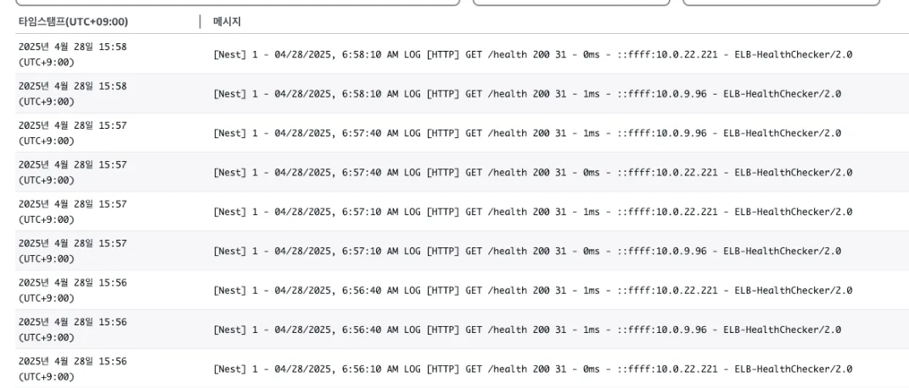
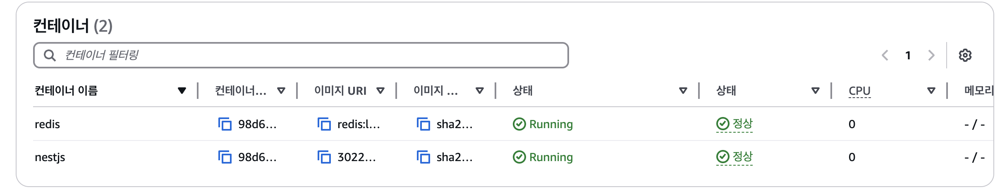

컨테이너의 백엔드 애플리케이션이 잘 돌아가고 있는지 확인하는 Health Check를 위해 `CMD-SHELL, curl -f http://localhost:3000/health || exit 1` 명령어로 상태 확인을 수행하도록 설정하였다.

ECS 배포가 수행된 후 컨테이너가 boot-up되는 과정을 로그로 확인했으나, 이상하게 얼마 뒤 unhealthy 상태로 판단되어 종료되고 있었다.

해결을 위해 상태 확인 유예 시간도 크게 늘려보았지만 문제는 계속 발생하였다.



추가적으로 로그에는 ELB-HealthChecker 라는 이름으로 /health API에 요청을 주기적으로 보내고 있었는데, 처음엔 이게 ECS에서 수행하는 상태 확인 과정인 줄 알았으나, ECS 서비스에 붙여놓은 ALB 로드밸런서의 요청이었다. 즉, ECS에서 보낸 상태 확인 요청은 서버에 도착하지 않은 것이다.

일단 빠른 배포가 우선이므로 급하게 상태 확인 설정을 모두 지운 다음 배포를 마무리했다.

하지만 올바른 ECS 환경을 위해서는 상태 확인이 필수적인데… 원인을 하루 빨리 찾아야겠다.

---

[How to diagnose Fargate Health Check failing?](https://www.reddit.com/r/aws/comments/g545bh/how_to_diagnose_fargate_health_check_failing/)

원인을 찾았다. nestjs 컨테이너에서 node:20-alpine을 사용했는데, 여긴 curl이 설치되지 않는다고 한다… 😭

```docker
FROM node:20-alpine

# Install curl for health check
RUN apk add --no-cache curl

WORKDIR /usr/src/app
COPY package*.json ./
RUN npm ci
COPY dist ./dist

CMD [ "node", "dist/main.js" ]
```

위와 같이 alpine 이미지에 curl을 설치하는 명령어를 추가해 curl을 실행할 수 있도록 변경하였다.



이제 nestjs 컨테이너도 정상 상태로 확인 가능하다!