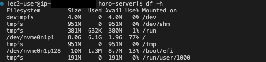
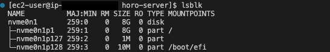
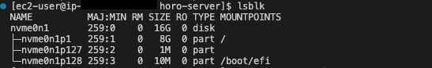
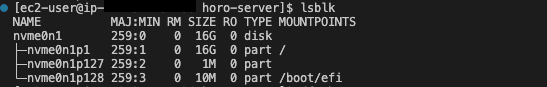
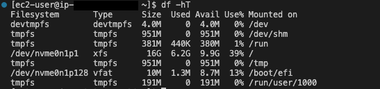

EC2 기본 볼륨 설정인 8GB로 서버를 사용하고 있다가 용량이 너무 적어보여 확장하기로 했다.



`lsblk` 명령어로 파티션 상태를 확인해주고, AWS 웹페이지에서 볼륨 수정 요청을 보낸다.



조금 기다린 후 확인해보면 디스크 크기가 8GB가 16GB로 변경되었음을 확인할 수 있다.

---

하지만 파티션 용량은 8GB 그대로이기 때문에 파티션 용량을 확장해주는 작업이 필요하다.

```bash
$ sudo growpart /dev/nvme0n1 1
CHANGED: partition=1 start=24576 old: size=16752607 end=16777183 new: size=33529823 end=33554399
```

위와 같이 `growpart` 명령어를 사용해 `/dev/nvme0n1` 디스크의 1번째 파티션을 확장시킨다.



그 후 `lsblk` 명령어로 파티션 상태를 다시 확인해주면 이번엔 정상적으로 파티션이 확장되었음을 확인할 수 있다.


---

하지만 df를 사용해서 용량을 확인해보면 아직도 8GB가 그대로 표시되고 있는데, 파티션이 확장되었지만 파일 시스템은 아직 확장되어 있지 않은 상태이기 때문이다.

그래서 AWS 공식문서를 따라 resize2fs를 사용해 파일 시스템을 확장하려고 했는데…

```bash
$ sudo resize2fs /dev/nvme0n1
resize2fs 1.46.5 (30-Dec-2021)
resize2fs: Device or resource busy while trying to open /dev/nvme0n1
Couldn't find valid filesystem superblock.
```

위와 같이 busy하다는 설명과 함께 확장에 실패하였다.

혹시 실행중인 백엔드 애플리케이션 때문일까 싶어서 모두 종료하고 다시 확장을 시도해봤지만 여전히 실패했다.

열심히 구글링 해본 결과, resize2fs는 마운트된 파일 시스템에서 작동할 수 없도록 설계되었다고 한다. 그래서 busy하다고 말한 것 같다.

언마운트/마운트 작업을 수행하는 것보다 인스턴스를 재부팅해서 간단히 해결한 케이스가 많아서 `sudo reboot` 로 재부팅을 수행하였다.



그 후 df를 실행해보니 최종적으로 16GB가 용량에 반영되었음을 확인할 수 있었다!

# 참조

[Extend the file system after resizing an Amazon EBS volume - Amazon EBS](https://docs.aws.amazon.com/ebs/latest/userguide/recognize-expanded-volume-linux.html?icmpid=docs_ec2_console)