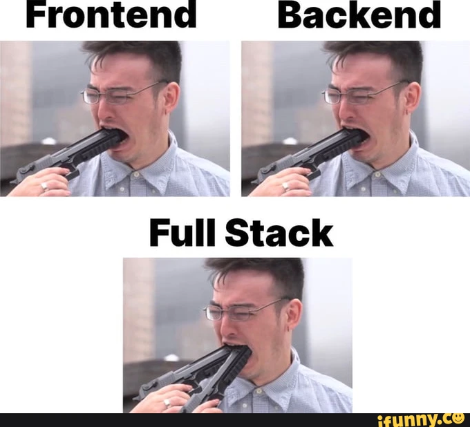
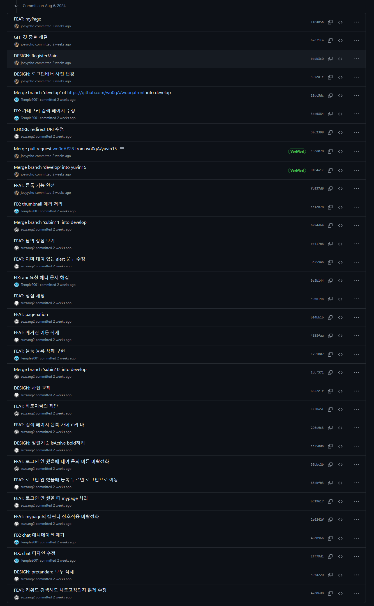
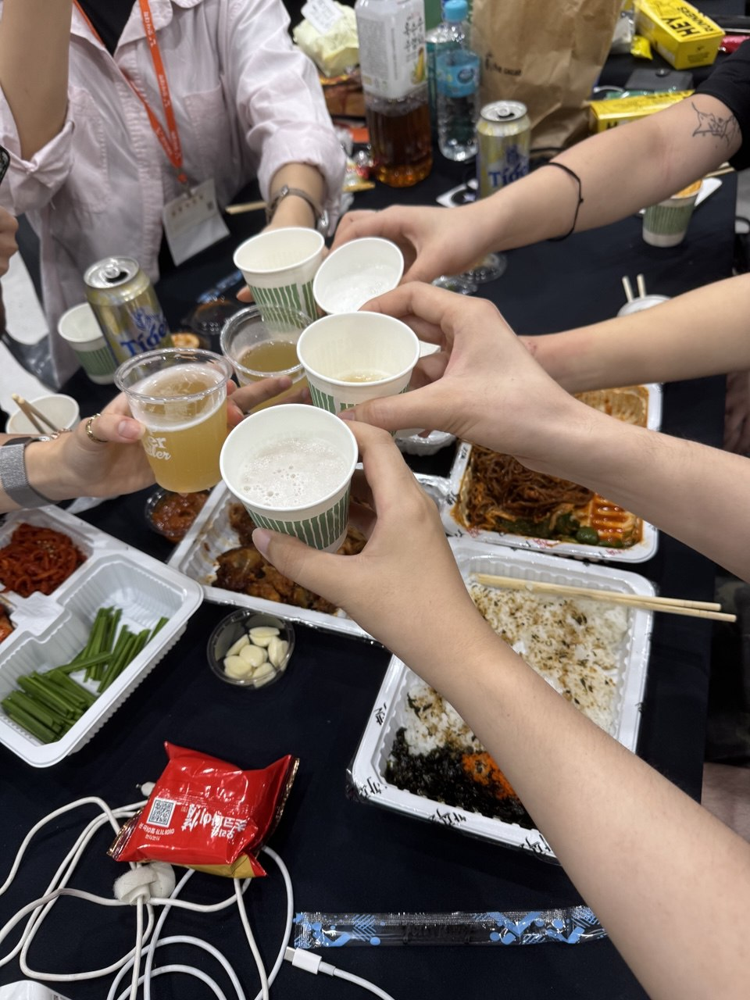
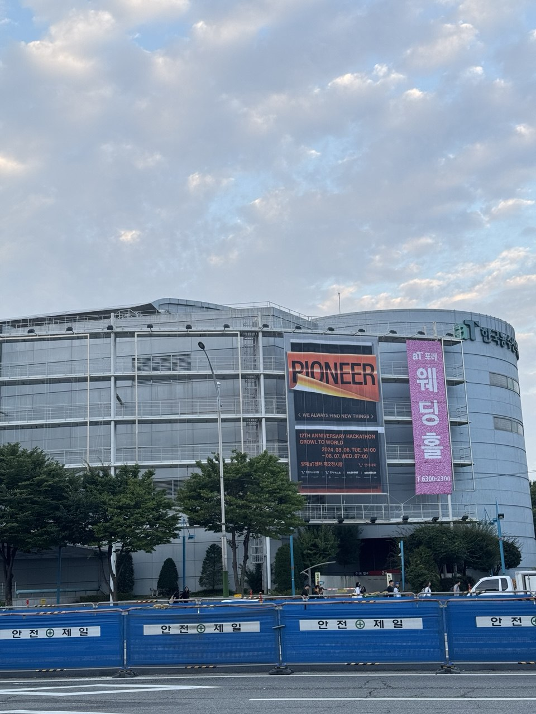
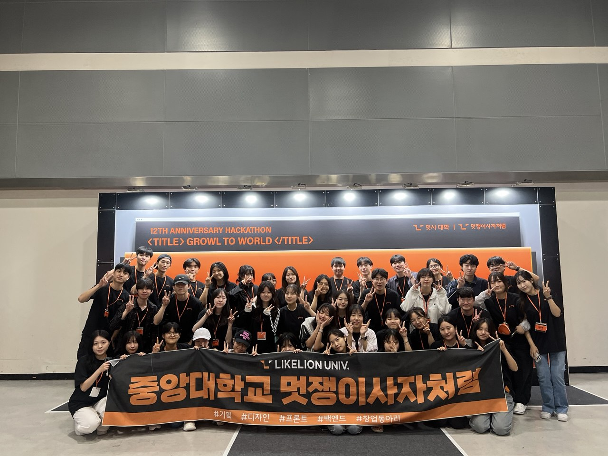

# 목차

# 내 인생 첫 해커톤
드디어 멋쟁이사자처럼 중앙 해커톤의 막이 올랐다.

중앙 해커톤 참가는 내가 중앙대 멋사에 들어가게 된 이유 중 하나이기도 했다. 개발 협업 경험을 최대한 많이 쌓기 위해 들어간 멋사에서 해커톤 참가는 빼놓을 수 없기 때문이다. 지금까지 멋사에서 같이 활동했던 팀원들과 제한된 시간 안에 결과물을 만들어 낸다는 경험은 나에게 있어 정말 소중할 것이라고 생각해 이번 해커톤에서는 더욱 최선을 다해야겠다는 결심이 들었다.

공지되었던 이번 해커톤의 주제는 **"IT 기술을 활용하여 현대인의 건강 (wellness) 문제를 해결할 수 있는 서비스를 개발하시오."** 였다.
올해 초반에 각 대학에서 자체적으로 실시했던 멋사 아이디어톤 대회의 주제와 완전히 같아서 나를 포함한 대부분의 부원들이 당황했지만, 오히려 같은 주제로 인해 아이디어톤에서 접했던 시행착오들을 발판삼아 더 좋은 아이디어를 얻을 수 있을지도 모르기 때문에 단점보다 장점이 많을 것이라는 생각도 들었다. 그리고 해커톤인 만큼 **개발**에 많은 비중을 둘 것이기 때문에 이전과 같은 경험이진 않을 것이라고 생각했다!

주제 발표 이후에는 기획 파트의 부원들이 각자가 구상한 이번 해커톤을 위한 서비스를 발표하고, 나머지 디자인, 프론트엔드, 백엔드 파트의 부원들이 마음에 드는 서비스를 골라 팀원으로 지원하는 팀 빌딩 과정을 거쳤다. 그렇게 정해진 팀에는 아는 얼굴들이 많아 매우 반가웠다! 😄

# 본격적인 개발
멋쟁이사자처럼 중앙 해커톤은 약 한달간의 기간동안 주제에 알맞은 서비스를 개발하고 오프라인 해커톤 당일에 무박 2일로 개발 마무리 및 배포, 그리고 높은 점수를 받은 팀을 몇개 선정하여 발표를 진행하고 평가하는 형식으로 진행된다.
따라서 해커톤 당일 이전 한달동안 모든 개발을 끝내야 한다는 뜻이다. ~~그러나 듣기로는 당일 마감 전까지 개발 안 한 팀이 단 한 팀도 없다고...~~

주어진 시간은 그렇게 많지 않다. 우리 팀도 팀이 편성되자마자 바로 서비스 개발에 착수했다.

우리 팀이 만들고자 하는 서비스는 **"운동 용품 대여로 현대인의 운동 부족을 해결해주는 서비스"** 이다. 사용자간 물건을 주고받는 것은 당근마켓과 유사하지만 우리 서비스는 여러 물건들 중 운동 용품에 특화된 구조와 **대여**를 지원한다는 특징을 차별점으로 설정했다.

그러므로 사용자들이 대여를 위해 서로 의사소통을 하기 위한 장치인 **채팅**이 필수불가결하게 되었는데, 나는 이번에 이 채팅 시스템을 집중적으로 맡게 되었다.

## 깃허브 Repository 링크

[프론트엔드 Repository](https://github.com/Temple2001/likelion-hackathon-front)

[백엔드 Repository](https://github.com/Temple2001/likelion-hackathon-back)

## 채팅 서버 구현

Django에는 WebSocket 통신 구현을 도와주는 `Channels`라는 라이브러리가 존재한다. 이를 통해 간단한 메서드 호출만으로 WebSocket 통신 관리를 수행할 수 있어 채팅 구현에 정말 많은 도움이 됐다.

자세한 채팅 구현 과정은 아래의 포스트로 작성해 놓았다.

[Django channels를 이용한 웹소켓 서버 구현](/learning/backend/django-channel-chat/)

## 서버 배포
이번 중앙 해커톤에서는 외부에서 URL로 접속 가능한 웹서비스를 만들어야 하기 때문에 서버 배포가 필수이다. WebSocket 채팅 기능이 포함되어 있기 때문에 서버 배포가 더 어려워지는 것 아닌가 하는 걱정이 이만저만이 아니었지만 채팅 구현 때 참고했던 위의 블로그에서 서버 배포까지 다루었기 때문에 마음이 편한 상태에서 개발에 집중할 수 있었다. (감사합니다... 😭)

우리 팀이 만든 웹서비스는 Django 웹프레임워크, nginx 웹서버, postgreSQL 데이터베이스 서버, 그리고 Channels 라이브러리 구동에 필요한 Redis까지 총 4개의 프로그램이 동시에 동작해야 한다. 이걸 배포하고 수정할 때마다 하나씩 껐다 켰다 한다면 정말 정신이 나갈 것이므로, Docker를 이용해 컨테이너화 시키고 Docker Compose로 한번에 관리하여 개발 및 배포 프로세스를 간소화시켰다.

```yml title="docker-compose.yml"
services:
  nginx:
    build: ./nginx
    image: wooga_nginx:latest
    volumes:
      - static_volume:/usr/src/app/_static
      - ${ssl 키 경로}:/etc/nginx/ssl/fullchain.pem:ro
      - ${ssl 키 경로}:/etc/nginx/ssl/privkey.pem:ro
    ports:
      - 80:80
      - 443:443
    depends_on:
      - web
    env_file:
      - ./.env.prod
  
  web:
    build: .
    image: wooga_web:latest
    command: daphne likelion_hackathon.asgi:application --port 8000 --bind 0.0.0.0 -v2
    volumes:
      - static_volume:/usr/src/app/_static
      - ./:/usr/src/app/
    expose:
      - 8000
    env_file:
      - ./.env.prod
    depends_on:
      - db
      - redis
  
  db:
    image: postgres:12.0-alpine
    volumes:
      - postgres_data:/var/lib/postgresql/data/
    env_file:
      - ./.env.prod

  redis:
    image: redis:alpine
    ports:
      - "6379:6379"
  
volumes:
  postgres_data:
  static_volume:
```

Django를 일반적인 REST API를 제공하는 서비스로 사용할 때는 Python 웹 어플리케이션과 웹 서버 사이에 WSGI(Web Server Gateway Interface)를 사용한다. WSGI는 동기식 인터페이스로 하나의 요청이 완전히 처리될 때까지 다른 요청을 기다리게 한다. 그러나 이번 개발에서 사용될 WebSocket 통신은 동기식 인터페이스로는 제대로 작동할 수 없다. 따라서 ASGI(Asynchronous Server Gateway Interface)를 사용해 비동기식 프로그래밍을 구현해야 한다. Django는 기본적으로 ASGI가 아닌 WSGI를 사용하므로, 별도의 설정이 필요하다.

Django를 배포할 때 일반적으로 사용하는 gunicorn은 WSGI 서버이므로, ASGI 서버를 사용해야 한다. 이번 프로젝트에서 사용된 ASGI 서버는 **Daphne(다프네)** 이다. 위 `docker-compose.yml` 코드에서도 Django를 배포할 때 daphne가 사용된 것을 볼 수 있다.

DB로 PostgreSQL을 사용하지만 추가적으로 Redis를 사용하는 이유는 Django Channels가 메시지 브로커의 기능을 위해 Redis를 사용하기 때문이다. 채널 레이어에서의 데이터 전달을 위한 메커니즘을 제공하며, 이를 통해 다수의 컨슈머가 서로 통신할 수 있도록 해준다고 한다. Channels 공식문서에서도 Redis 사용을 적극 권장하고 있다.

---

그리고 Docker Compose를 이용한 배포에 더해 Github Actions를 이용한 자동 배포도 구성했다.

```yml title="auto-deploy.yml"
name: Auto Deploy with Docker Compose

on:
  push:
    branches:
      - dev

jobs:
  deploy:
    runs-on: ubuntu-latest

    steps:
    - name: Execute remote SSH commands
      uses: appleboy/ssh-action@v1.0.3
      with:
        host: ${{ secrets.SSH_HOST }}
        username: ${{ secrets.SSH_USER }}
        key: ${{ secrets.SSH_KEY }}
        port: ${{ secrets.SSH_PORT }}
        script: |
          cd /home/ubuntu/repositories/woogaback
          docker compose down
          git pull
          docker compose up -d
          docker compose exec web python manage.py makemigrations
          docker compose exec web python manage.py migrate
          docker image prune -f
```

이미 Docker Compose로 배포 과정을 간소화하였기 때문에 Github Actions에서 수행해야 할 작업은 그저 `git pull` 이후에 `docker compose up -d` 뿐이다. 안정적인 배포를 위해 Django migration 작업과 docker 캐시 삭제 작업을 추가했다.

이로써 `dev` 브랜치에 push하는 작업만으로 자동으로 서버가 변경사항을 반영하여 배포까지 수행하는 환경을 구성하게 되었다!

## 채팅 페이지 구현
이렇게 이번 프로젝트에서 나의 역할은 끝나......는 줄 알았으나 프론트 파트 팀원들이 엄청난 양의 작업으로 고통스러워 하던 상황이라 어찌저찌 내가 채팅 웹 페이지까지 구현하게 되었다.

오랜만에 하는 프론트엔드 개발이라 고된 행군길이 예상되었지만 오히려 채팅 서버를 직접 구현했었기 때문인지 그렇게 막막한 작업은 아니었다.

```js title="websocket.js"
...

class WebSocketService {
	constructor() {
		this.socket = null;
	}

	/**
	 * WebSocket 연결을 설정하는 함수
	 */
	connect(roomId, onMessage) {
		this.socket = new WebSocket(
			`wss://${SERVER_URL}/ws/room/${roomId}/messages`
		);
		this.socket.onmessage = (event) => {
			const data = JSON.parse(event.data);
			onMessage(data);
		};
	}

	/**
	 * WebSocket을 통해 메시지를 전송하는 함수
	 */
	sendMessage(message) {
		if (this.socket && this.socket.readyState === WebSocket.OPEN) {
			this.socket.send(JSON.stringify(message));
		}
	}

	/**
	 * WebSocket 연결을 해제하는 함수
	 */
	disconnect() {
		if (this.socket) {
			this.socket.close();
		}
	}
}

const webSocketService = new WebSocketService();
export default webSocketService;
```

채팅 페이지 개발에 가장 중점이 되는 부분은 역시 채팅을 위한 WebSocket 통신 부분이었다. 그러나 javascript 자체에서 WebSocket 통신을 위한 기능을 지원해주기도 하고, 레퍼런스들도 인터넷에 많이 올라와 있어 개발하는데 큰 문제를 겪지 않았다.

웹소켓 통신을 하는 법은 간단하다. 채팅 API 주소로 WebSocket 클래스의 인스턴스를 생성하고, 그 인스턴스의 `onmessage`에 메시지를 받았을 때 수행할 함수를 할당하고 `send` 메서드로 메시지를 전송하면 된다. 그 과정에서의 네트워크 관리는 모두 javascript 내부에서 담당한다.


# 해커톤 당일


역시나 우려대로 해커톤 전날까지 개발을 마치는 것은 무리였고, 우리 팀은 어떻게든 필수적인 기능들만 마무리하고 해커톤 당일에 오프라인에서 개발을 마치기로 했다.

백엔드 API는 모두 준비가 된 상태였고, 문제는 수많은 프론트엔드 페이지의 잡다한 버그들이었다. 나는 일단 백엔드 파트이고, 채팅 페이지를 직접 구현하긴 했지만 그 이외의 프론트 프로젝트 구조에 대한 정보는 전혀 없던 상태였다. 그러나 프론트엔드 팀원들이 고통받고 있는 모습을 본체만체할 수는 없었기 때문에 어떻게든 빠른 시간 내에 코드를 이해하고 버그를 잡으려 노력했다.



다만 다행이었던 점은 백엔드 API에서는 치명적인 버그나 잘못 설계된 부분이 없었다는 점이었고, 이런저런 수정사항이 있긴 있었지만 이전에 구성했던 자동 배포 환경 덕분에 매우 빠르게 수정사항을 반영할 수 있었다. 고생했던 노력이 빛을 발하는 순간이었다.

제출 전 마지막 5분은 정말 피말리는 상황이 벌어졌는데, 깜빡하고 중간에 바뀐 서비스 로고가 반영되지 않았다는 사실을 깨달은 것이었다. 밤 12시 정각 이후에 깃허브 레포에 커밋 내역이 있으면 탈락 처리되므로 무조건 12시 이전에 수정해야 했었는데, 모두가 힘을 합쳐 제출하기 약 30초전에 아슬아슬하게 커밋에 성공했다! 끝까지 안심할 수 없었던 해커톤이었다...



제출이 끝나고 긴장이 풀리고 나니 온 몸에 힘이 다 빠진 상태였지만 그래도 끝내 프로젝트를 완성시켰다는 성취감이 정말 기분 좋았다. 고생했던 팀원들과 함께 배달시킨 음식을 먹으며 해커톤 중에 있었던 이야기들을 서로 나누니 쌓였던 피로감도 날아가는 기분이었다!!



그렇게 밤새도록 우리 팀이랑 중앙대학교 멋사 부원들과 서로 만든 서비스를 구경하거나 수다 떨며 노는 등 결과 발표 전까지 시간을 보냈고 발표가 끝나자마자 피곤한 몸을 이끌고 집으로 돌아갔다. 집에 돌아가는 과정은 피곤해서 기억조차 안날 정도로 힘들었던 것 같다...

# 후기

처음으로 참가했던 해커톤인 멋쟁이사자처럼 중앙 해커톤은 성공적이었다.

비록 수상을 하진 못했지만 개발 협업 경험을 최대한 쌓고 싶다는 내 목적은 원없이 달성할 수 있었고, 서버 관리 및 배포 경험과 언젠가 시도해보고 싶었던 웹소켓 통신 경험을 쌓을 수 있어서 여러모로 많은 것을 얻고 갈 수 있었다고 생각한다. 특히 채팅 기능은 백엔드와 프론트엔드 모두 직접 개발했다 보니 웹소켓 통신 과정을 더욱 잘 이해할 수 있었다. 그리고 이번에는 docker compose를 이용해 서버 배포 및 자동화를 구성하였는데, 다음 프로젝트에는 k8s를 이용해 더 체계적이고 색다른 배포 경험을 해보고 싶다는 생각도 들었다.

첫 술에 배부를 수 없다라는 말처럼 처음부터 눈에 띄는 결과를 얻을 수 있을 거라고는 애초에 생각하지도 않았다. 대신 이번 과정을 통해 얻은 경험은 오랫동안 남을 수 있는 귀중한 자원이므로 이런 경험들을 최대한 살려 내 강점으로 만들 수 있도록 하는 것이 가장 중요하다고 생각한다.

