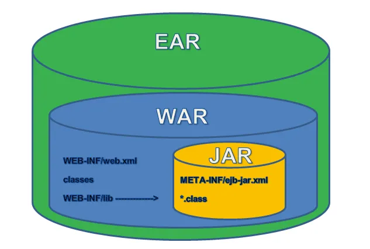

# 목차

# 배운 내용 정리

## 배포의 과정


책 출판 과정과 비교할 수 있다.

1. 번역 : 영어를 우리나라 독자들이 이해할 수 있도록 해석해 적음.
    
    ⇒ 컴파일(`Compile`) (.java → .class)
    
2. 검수 : 1의 내용의 오류는 없는지, 오탈자는 없는지 확인함.
    
    ⇒ 빌드(`Build`) (결과물로써 .jar파일 또는 .war파일로 패키징됨)
    
3. 판매 : 2의 내용을 독자들이 접할 수 있도록함.
    
    ⇒ 배포(`Deploy`) (서비스를 여러 클라이언트가 사용할 수 있도록 환경을 구성함)
    

## 빌드 도구

Spring Initializer에서 설정했었던 것 중에 빌드 도구를 설정하는 부분이 있었다.

빌드 도구는 빌드 자동화를 도와주는 프로그램이다.

---

빌드 도구의 역할은 다음과 같다.

- 라이브러리를 자동으로 추가, 관리 및 라이브러리 버전을 자동 동기화 (의존성 자동 업데이트)
- 프로젝트의 정보 전달
- 프로젝트 라이프 사이클 관리

Spring에서 사용되는 빌드 도구로는 대표적으로 Gradle과 Maven이 있다.

- Maven : XML기반의 대표적인 Java 프로젝트용 빌드 도구
- Gradle :  Maven을 보완한 groovy기반의 빌드 도구

현재는 대부분의 경우에 성능이 좋고 가독성도 좋은 Gradle을 사용한다.

---

- 캐시 사용을 통한 Maven보다 최대 100배 빠름
- Wrapper를 통해 Gradle이 설치 되지 않은 환경에서도 빌드 가능
    - **`Gradle.Wrapper`** : 환경에 상관 없이 Gradle 빌드를 수행할 수 있도록 하는 내장 task
        - Java나 Gradle이 설치 되어 있지 않아고 빌드 가능
        - 사용자가 프로젝트 개발자와 동일한 버전의 Gradle버전 사용 가능
- XML기반이 아닌 Groovy기반 언어로 작성하여 높은 가독성
    - **`groovy`** : JVM에서 실행되는 스크립트 언어로 Java와 문법이 비슷하고 호환이 된다.

## 빌드 결과물



빌드를 하게 되면 프로그래머가 작성한 소스 코드를 **실행할 수 있는 독립적인 형태**로 변환한 결과가 나온다.

- **.war, .jar** : Spring 프로젝트 빌드의 결과물
- **역할 :** 애플리케이션을 쉽게 배포하고 동작시킬 수 있도록 관련 파일(리소스, 속성 파일 등)을 패키징한 것

- WAR (Web Application Archive)
  Servlet / JSP 컨테이너에 배치할 수 있는 웹 어플리케이션 압축파일 포맷
  **웹 관련 자원**을 포함 (JSP, Servlet, JAR, Class, XML, HTML, Javascript)
  사전 정의된 구조를 사용
  별도의 웹서버(WEB) 또는 웹 컨테이너(WAS) 필요
  즉, JAR파일의 일종으로 웹 어플리케이션 전체를 패키징 하기 위한 JAR 파일.

- JAR (Java Archive)
  JAVA 어플리케이션이 동작할 수 있도록 자바 프로젝트를 압축한 파일.
  독립 실행형 어플리케이션의 실행이나 라이브러리 모듈을 다른 Java 어플리케이션과 함께 사용할 때 유용.
  **class 파일, resource 파일, 라이브러리 파일, 속성 파일**을 포함
  JRE (JAVA Runtime Environment)만 있어도 실행 가능

## .jar vs .war

Spring과 SpringBoot의 차이로 인해 사용하는 빌드 결과물이 다르다.

- Spring에서의 사용
    - 전통적으로 WAR 파일을 생성해서 웹 서버(예: Tomcat)에 배포 (예를 들어, Tomcat에 WAR 파일을 올리면 Tomcat이 애플리케이션을 실행시킴)
    - 보안, 성능 최적화, 로드 밸런싱 같은 서버의 고급 기능을 그대로 사용할 수 있어서 대규모 애플리케이션을 운영하기에 적합
    
- Spring Boot에서의 사용
    - 스프링 부트는 내장 서버(Tomcat, Jetty 등)를 포함해서 애플리케이션을 JAR 파일로 패키징 한다.
    - 이 JAR 파일은 애플리케이션과 모든 필요한 의존성을 포함하고 있어서, 별도의 서버 설치 없이 실행할 수 있다.  덕분에 배포 과정이 간단해지며, 복잡한 서버 설정 없이도 빠르게 애플리케이션을 실행 가능

따라서 Spring Boot를 많이 사용하는 최근에는 JAR 파일을 사용한다. (그러나 환경에 따라 WAR 파일도 충분히 의미있을 수 있음)

## Gradle로 빌드하기

```bash
./gradlew build
```

빌드하여 `build` 폴더에 빌드 결과를 넣는다. 

```bash
./gradlew build -x test
```

원래는 테스트 폴더에 있는 모든 테스트를 수행한 뒤 모두 통과해야 빌드가 가능한데, 임의로 테스트로 제외하고 빌드를 수행할 수 있다.

# 후기

이번 세션에서는 빌드를 수행하여 jar 파일로 배포를 수행하는 과정을 배워보았다.

스프링은 파일 하나를 실행하는 것만으로 배포가 가능하여 쉽고 빠른 배포가 가능하다. 그리고 Gradle같은 좋은 성능의 빌드 도구도 잘 마련되어 있어 배포 과정이 부담스럽지 않다는 점이 굉장히 매력적인 것 같다.

회고 중에 Fat Jar 라는 개념을 알게 되었는데, Fat Jar란 라이브러리 같은 실행에 필요한 모든 의존성이 포함되어 빌드된 jar 파일을 말한다.

스프링 부트로 별다른 옵션 없이 빌드를 수행하게 되면 `-plain` 이라는 이름이 붙은 Plain Jar와 `-plain` 이라는 이름이 붙지 않은 Fat Jar가 생성되며, 여기서 Fat Jar를 실행하면 파일 하나만으로 서비스를 실행할 수 있게 되는 것이다.

물론 그만큼 용량이 커지기 때문에 서버 환경에 맞춰서 plain jar를 사용할지 fat jar를 사용할지 유동적으로 선택할 수 있어야 할 것이다.