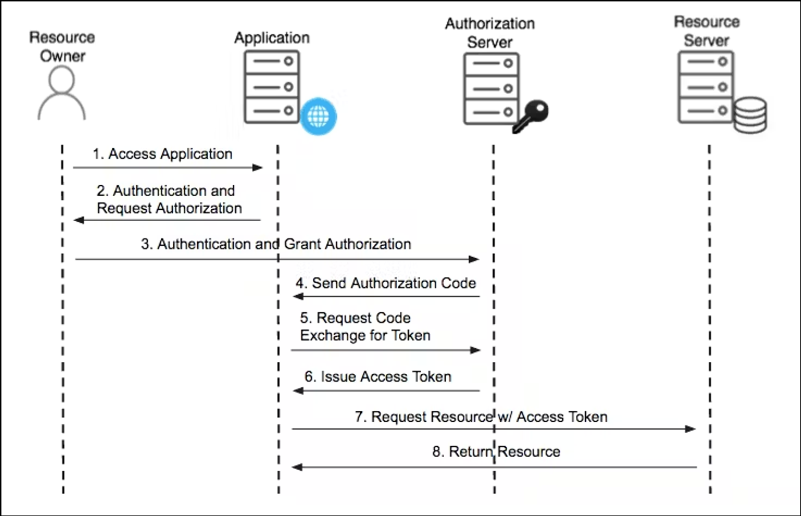
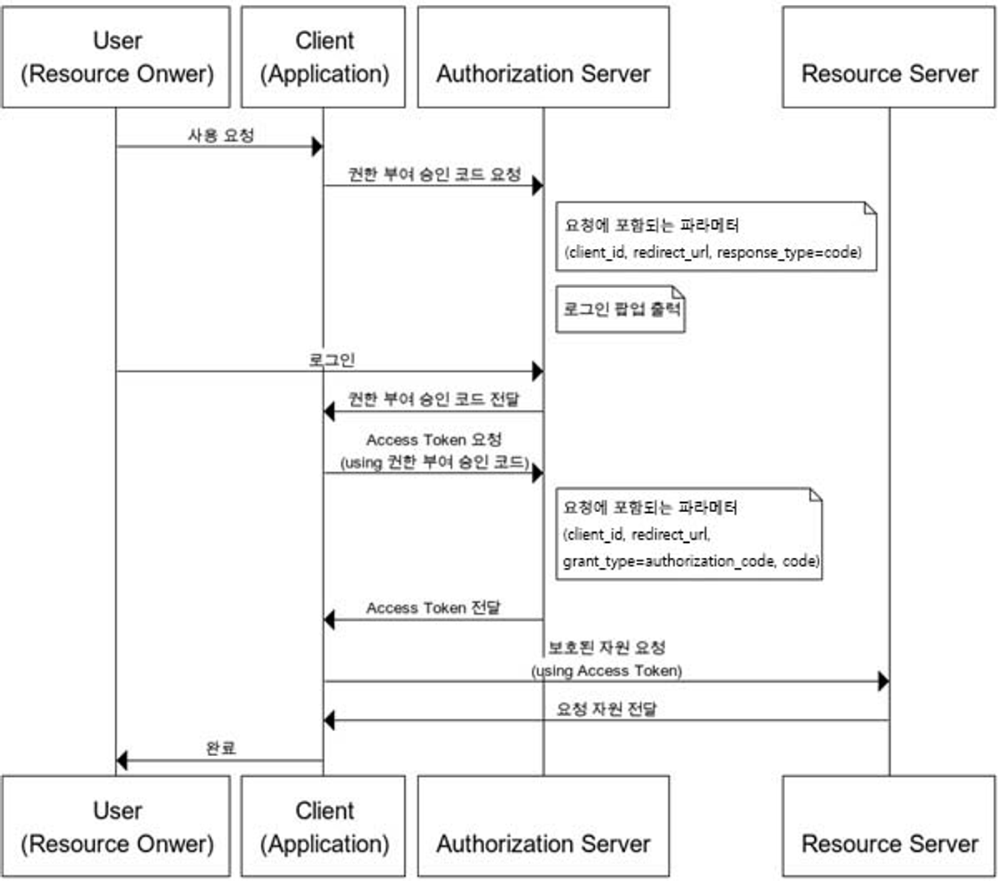

# 목차

# 배운 내용 정리

## OAuth

제3자의 클라이언트에게 보호된 리소스를 제한적으로 접근하게 해주는 프레임워크이다.

- 리소스 소유자와 HTTP 서비스 간의 승인 상호 작용을 조율하여 리소스 소유자를 대신하여 타사 애플리케이션이 HTTP 서비스에 대한 제한된 액세스 권한을 얻거나 타사 애플리케이션이 자체적으로 액세스 권한을 얻도록 허용
- 인터넷 사용자들이 비밀번호를 제공하지 않고 다른 웹사이트 상의 자신들의 정보에 대해 웹사이트나 애플리케이션의 접근 권한을 부여할 수 있는 공통적인 수단으로서 사용되는, **접근 위임**을 위한 개방형 표준

OAuth 2.0에서는 아래와 같은 4가지 역할이 존재한다.

1. **Resource owner**
    
    보호된 리소스에 대한 액세스 권한을 부여할 수 있는 개체
    
    사람이면 **최종 사용자**
    
    예시 - 내가 구글 계정을 가지고 있다 & 구글 계정에 등록된 이름, 사진 등의 데이터 주인은 
    
    ⇒ **Resource owner = 나**
    
2. **Resource server**
    
    보호된 리소스를 호스팅할 수 있는 서버
    
    access token을 통해 보호된 리소스 요청 수락 및 응답
    
    예시 - 구글은 내 계정 정보를 가지고 있지만 데이터 주인은 나니까 함부로 공유 불가능
    
    ⇒ **Resource server = 구글 데이터 센터**
    
3. **Client (Application)**
    
    리소스 소유자를 대신하여 보호된 리소스를 요청하는 애플리케이션
    
    ⚠️ 보편적으로 개발에서 지칭하는 프론트-백의 Client-Server가 아님 
    
    예시 - 노션에서 구글 소셜로그인을 했더니 구글에 따로 허용이나 요청하지 않아도 
          노션이 알아서 구글 계정 정보를 가져오고 노션 로그인을 시켜줌
    
    ⇒ **Resource Server(구글)** 의 **Client = 노션** (+기타 소셜로그인 활용하는 서비스)
    
4. **Authorization server**
    
    리소스 소유자를 인증하고 인가 권한을 획득한 후 클라이언트에 액세스 토큰 발급
    
    데이터를 가지고 있는 쪽에서 권한을 부여할 수 있으므로 보통 제공업체가 된다.
    
    예시 - 구글로 로그인하기 → 구글 페이지에서 로그인하고 구글 계정 정보로 노션에 로그인
          구글 로그인 과정 = 인증 / 노션에 정보 제공 동의 구함 = 인가 권한 획득
          → 노션에 구글 데이터 액세스 토큰 발급 
    
    ⇒ **Authorization server = 구글**
    

보통 아래와 같은 흐름을 갖는다.

**사용자 → 노션 |** 노션에 들어간다.

**사용자 → 노션 |** 구글 계정으로 로그인하기를 누른다. (노션이 인증/인가 요청)

**사용자 → 구글 |** 구글 로그인 페이지로 이동해서 로그인한다. (사용자가 인증을 하면 인가 요청됨)

**구글 → 노션 |** 인가 코드를 준다.

**노션 → 구글 |** 인가 코드로 계정 정보 접근이 허용된 토큰을 요청한다.

**구글 → 노션 |** 구글 데이터 액세스 토큰을 준다.

**노션 → 구글 |** 액세스 토큰으로 계정 정보를 요청한다.

**구글 → 노션 |** 유효한 요청이라면 정보를 반환한다.

인가 코드를 부여하는 구체적인 방식은 아래와 같다.

**사용자 → 노션 |** 노션에 들어간다.

**사용자 → 노션 |** 구글 계정으로 로그인하기를 누른다. (노션이 인증/인가 요청)

**사용자 → 구글 |** 구글 로그인 페이지로 이동해서 로그인한다. (사용자가 인증을 하면 인가 요청됨)

- 노션 서버에서 구글 OAuth 2.0 서버 엔드포인트 (Open API) 호출
    
    **`https://accounts.google.com/o/oauth2/v2/auth?client_id={client_id}&response_type=code&redirect_uri={GOOGLE_CALLBACK_URI}&scope={scope}`**
    
    [Google의 OAuth 2.0 서버로 리디렉션 + 엔드포인트](https://developers.google.com/identity/protocols/oauth2/javascript-implicit-flow?hl=ko#redirecting) ← 참고문서
    

➕ 처음 로그인한다면 노션에 계정 정보 제공하는 걸 동의하는지 질문

**구글 → 노션 |** 인가 코드를 준다.

**노션 → 구글 |** 인가 코드로 계정 정보 접근이 허용된 토큰을 요청한다.

- 노션 서버에서 구글 엔드포인트 호출
**`https://oauth2.googleapis.com/token?client_id={client_id}&client_secret={client_secret}&code={code}&grant_type=authorization_code&redirect_uri={GOOGLE_CALLBACK_URI}&state={state}`**

**구글 → 노션 |**  액세스 토큰을 준다.

**노션 → 구글 |** 액세스 토큰으로 계정 정보를 요청한다.

- 액세스 토큰으로 다양한 API를 호출할 수 있다. (ex. 이메일, 구글 드라이브 파일 목록 등)
- 물론 노션이 요청하고 사용자가 허가한 범위 내에서만 가능하다.
- 계정 정보: **`https://www.googleapis.com/oauth2/v1/tokeninfo?access_token={access_token}`**

**구글 → 노션 |** 유효한 요청이라면 정보를 반환한다.

## 프론트 ↔ 백엔드 상호작용

체크리스트
1. [GCP] GCP에 등록된 callback URI ↔ 프론트에서 파라미터로 넘기는 callback URI가 같은지
2. [GCP] 승인된 자바스크립트 원본 리스트에 프론트가 쓰는 사이트 주소가 잘 들어있는지
3. [프백] 프론트가 코드를 넘기는 방식과 백이 코드는 받는 방식이 동일한지 (쿼리, 바디 등)

# 후기

OAuth를 드디어 배우게 되었다.

OAuth의 로직만 봤을 때는 "음 복잡하면서도 꽤 단순하네"라고 생각이 들어 편하게 과제에 도전해봤는데… 나를 기다리는 건 온갖 알 수도 없는 에러들이었다. 😟

익숙치 않은 Google의 API를 이용해서인지 정말 머리가 아픈 과정이었다…

allauth 라이브러리의 SocialAccount 테이블은 자동으로 생성되어 OAuth 관련 인증 내용들을 자동으로 저장하고 관리해주는 것 같은데, 내가 과제를 수행하면서 볼 때는 SocialAccount 테이블에 아무것도 없었다. 뭐가 잘못된 걸까…

그래도 Google API로 부터 토큰값을 받는 과정은 정상적으로 수행되었다. 차후에 SocialAccount 작동방식에 대해 더 자세히 알아보아야겠다는 생각이 들었다…

---

- 로그인 API는 왜 GET이 아니라 POST로 요청을 받을까?

간단하다. GET으로 요청을 받으면 HTTP body를 사용하지 못하므로 url 파라미터 (ex: /login?id=id&pwd=pwd) 로 아이디와 비밀번호 같은 개인정보를 받아야 하는데, 네트워크 특성상 url 요청을 가로채서 그 url을 읽어 아이디와 비밀번호를 캐내는 것이 매우 쉽다. 해커로부터 매우 위험해지는 것이다.

그러나 POST 요청을 보내면 HTTPS의 보안 특성상 body에 있는 내용을 가로채서 읽는 것이 매우 어려워지기 때문에(절대 불가능한 건 아닌듯… 해킹 무셔…) 안전하게 사용자의 개인정보를 외부로부터 보호할 수 있게 된다.
