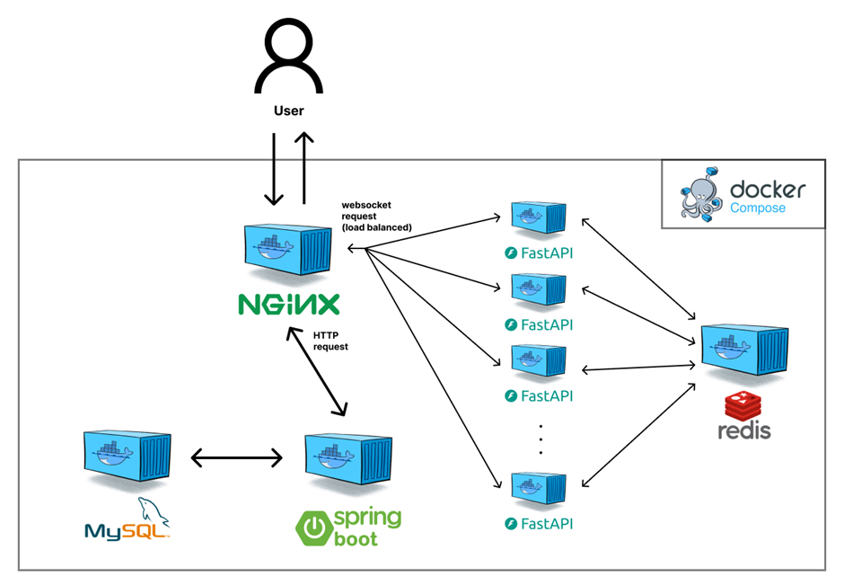

# 목차

# 개요
학교 프로젝트로 외국인 관광객들을 위해 음식점 메뉴판을 분석하고 각자 어떤 메뉴를 선택했는지에 대한 정보를 실시간으로 일행과 공유할 수 있는 기능을 가진 서비스를 만들게 되었다.

그 중에서 메뉴 선택 정보 실시간 공유 기능을 개발하기 위해 웹소켓을 기반으로 한 API를 작성했었다.

구현 자체는 간단할 것이라 생각했지만 이내 큰 고민에 빠지게 되었다.

서비스 특성상 점심시간과 저녁시간에 사용자가 몰릴 것이라는 생각이 들었는데, 그 특정시간에 많은 사용자들이 요청 주기가 빈번한 메뉴 선택 기능을 사용한다면 트래픽 과부하가 발생할 것이 뻔하기 때문이다.

그리고 모든 백엔드 서버 API를 한 애플리케이션(Spring Boot)에서 구현하였기 때문에 서버에 부하가 발생하면 단순히 메뉴 선택 기능만 사용하지 못하는 것이 아니라 다른 모든 기능도 사용하지 못하게 될 것이다.

프로젝트의 완성도를 위해서는 꼭 집고 넘어가야할 문제였다고 생각했고, 긴 조사 끝에 가장 큰 부하가 예상되는 실시간 메뉴 선택 및 정보 공유 기능을 다른 애플리케이션에 분리하고 복제하여 트래픽이 분산되도록 하는 MSA를 적용해보기로 결정하였다.

# MSA 도입
## 첫번째 구현
먼저 웹소켓 기반 실시간 메뉴 선택 및 정보 공유 기능을 기존 애플리케이션(Spring Boot)에서 분리하는 작업을 수행했다.

그리고 분리된 기능은 반드시 이전 애플리케이션과 같은 Spring Boot 프레임워크를 사용하지 않아도 되므로 웹소켓 적용이 Spring Boot보다 편리하고 간단한 Python의 FastAPI를 사용하기로 했다.

그리고 메뉴 선택에 대한 정보는 물리적으로 저장할 필요가 없고 빠른 조회 및 작성이 필요하므로 인메모리 데이터베이스인 Redis를 사용하였다.

아래는 작성된 코드의 일부분이다.

```python
@app.websocket("/ws")
async def websocket_endpoint(websocket: WebSocket):
    await websocket.accept()
    try:
        data = await websocket.receive_json()
        if data.get("type") == "connect":
            room_id = data.get("roomId")
            session_token = data.get("sessionToken")
            member_id = await verify_user(room_id, session_token)

            if member_id != None:
                if room_id not in connected_clients:
                    connected_clients[room_id] = []
                connected_clients[room_id].append(websocket)
                await websocket.send_json({"type": "connect", "status": "success"})
            else:
                await websocket.send_json({"type": "connect", "status": "fail"})
                await websocket.close()
                return

            while True:
                message = await websocket.receive_json()

                if message.get("type") == "choice":
                    menu_id = message.get("menuId")
                    quantity = message.get("quantity")

                    if menu_id == None or quantity == None:
                        continue

                    redis_client.hset(room_id, f"{menu_id}:{member_id}", quantity)
                    room_data = redis_client.hgetall(room_id)
                    response = {"type": "choice", "data": transform_dict(room_data)}

                    for client in connected_clients.get(room_id, []):
                        await client.send_json(response)

                elif message.get("type") == "refresh":
                    response = {"type": "refresh"}
                    for client in connected_clients.get(room_id, []):
                        await client.send_json(response)
```

서비스에서 메뉴 선택 및 정보 공유는 메뉴판 사진 업로드로 만들어진 room 안에 있는 사용자들간에 이루어지게 된다.

해당 room의 id와 유저 자신의 정보를 담고 connect 요청을 보내면 서버와 연결되며, 연결된 이후에 선택한 메뉴 id와 그 갯수를 담아 choice 요청을 보내게 되면 해당 데이터가 Redis에 저장되고 같은 room에 소속된 사용자들 중 현재 웹소켓으로 연결된 사용자들에게 그 내용을 브로드캐스팅하게 된다.

이 브로드캐스팅 과정을 위해 `connected_clients` 라는 dictionary를 관리하여 서버에 connect 요청을 보낸 사용자들을 room의 id로 묶어 저장하고 있다.

이제 이렇게 만들어진 FastAPI 애플리케이션을 컨테이너화 하여 여러 개로 복제한 뒤 여러 서버에 위치시키면 트래픽이 분산되어 문제를 해결할 수 있을 것이다!

...라는 간편한 방법으로 마무리될 수 있었다면 좋겠지만, 현실은 그렇지 않았다.

## 분리만 하면 끝...?
내가 간과했던 부분은 바로 "같은 room에 소속된 사용자들이 다른 컨테이너에 접속했을 때"였다.

같은 room의 사용자들은 같은 메뉴 선택 정보를 공유해야 하는데, 만약 그 사용자들이 복제된 컨테이너들 중 서로 다른 컨테이너에 각각 접속할 경우에는 각 컨테이너가 접속한 사용자들을 독립적으로 관리하므로 한 컨테이너에서 메뉴 선택 상황이 변경되었을 때 다른 컨테이너가 그것을 감지할 수가 없게 된다.

따라서 다른 컨테이너에 접속한 사용자가 room의 메뉴 선택 정보에 변경사항이 생겼다는 것을 전달 받지 못한다. 즉, 기능이 제대로 동작하지 않는 상황이 발생하게 된다.

결국 중요한 것은 복제된 컨테이너들이 서로 접속한 사용자에 대한 정보인 `connected_clients`의 내용을 공유해야 한다는 것이다.
기존 코드는 내부 변수로 그것을 관리하고 있기 때문에 불가능하였고 새로운 개선이 필요했다.

정말 다양한 곳에서 자료를 찾아보고 수많은 시행착오를 거친 결과, 답은 이미 사용하고 있었던 Redis 안에 숨어있었다.

## Redis의 pub/sub 기능으로 컨테이너 간 소통 문제 해결
Redis의 pub/sub은 Message Queue라는 통신 방법 중 하나이다.
pub/sub은 각각 **publish(발행)**, **subscribe(구독)** 를 의미한다. 특정 Topic을 구독한 구독자들에게 Topic에 발행된 메시지를 일괄적으로 송신하는 기능이다.

Redis의 pub/sub 기능을 사용한다면 컨테이너간 정보 공유를 가능하게 할 수 있다.

어떤 컨테이너에 A Room에 소속된 사용자가 접속했다면 해당 컨테이너에서 Redis에 "A Room"이라는 Topic을 subscribe한다.
그리고 주기적으로 "A Room" Topic에 publish된 메시지가 있는지 확인하며, 메시지가 새로 발행되었다면 해당 메시지를 컨테이너에 접속 중인 A Room 소속 사용자들에게 전파한다.

위 과정대로라면 하나의 Room에 속한 여러명의 사용자들이 여러 컨테이너에 나뉘어 접속한 환경에서도 pub/sub 기능을 통해 문제없이 데이터 교환이 가능해진다.

아래는 개선한 코드의 일부분이다.

```python
# 주기적으로 컨테이너가 구독한 Topic에 새롭게 publish된 메시지가 있는지 확인하는 함수
async def pubsub_loop():
    # get_message로 polling
    while True:
        try:
            message = pubsub.get_message()
            if message != None:
                message_type = message.get("type")

                if message_type != "message":
                    continue
                
                room_id = message.get("channel")
                message_data = json.loads(message["data"])

                if message_data.get("type") == "choice":
                    for client in connected_clients.get(room_id, []):
                        await client.send_json(message_data)
                if message_data.get("type") == "refresh":
                    for client in connected_clients.get(room_id, []):
                        await client.send_json({"type": "refresh"})
            else:
                await asyncio.sleep(0.1)
        except Exception as e:
            print(f"pubsub_loop 도중 에러 발생: {e}")

# lifespan 함수 정의를 통해 pubsub_loop 함수가 비동기적으로 실행될 수 있도록 구성
@asynccontextmanager
async def lifespan(app: FastAPI):
    global pubsub_task
    if not pubsub_task:
        print("create_task completed")
        pubsub_task = asyncio.create_task(pubsub_loop())

    yield

    if pubsub_task:
        print("task canceled")
        pubsub_task.cancel()
        try:
            await pubsub_task
        except asyncio.CancelledError:
            pass
    pubsub.close()

@app.websocket("/ws")
async def websocket_endpoint(websocket: WebSocket):
    await websocket.accept()
    try:
        data = await websocket.receive_json()
        if data.get("type") == "connect":
            room_id = data.get("roomId")
            session_token = data.get("sessionToken")

            if room_id == None or session_token == None:
                await websocket.send_json({"type": "connect", "status": "fail"})
                await websocket.close()
                return

            if room_id not in connected_clients:
                connected_clients[room_id] = []
                pubsub.subscribe(room_id)   # 컨테이너가 아직 구독하지 않은 Room Topic에 소속된 사용자가 새로 접속했을 때 해당 Room Topic에 subscribe 수행
            connected_clients[room_id].append(websocket)
            room_data = redis_client.hgetall(room_id)
            response = {"type": "connect", "status": "success", "data": transform_dict(room_data), "container": HOSTNAME}
            await websocket.send_json(response)

            ...(후략)

```

# 배포 방식 정리
Redis pub/sub 기능 적용을 통해 컨테이너간 데이터 교환 문제를 해결했으므로 MSA 구조를 적용하여 배포 방식을 결정하였다.


Reverse Proxy로 Nginx를 사용하여 url을 조건으로 HTTP 요청은 Spring Boot 애플리케이션 컨테이너로 보내지고, Websocket 요청은 복제된 FastAPI 컨테이너들로 **로드 밸런싱**되어 보내지도록 구성하였다.

FastAPI 컨테이너 복제는 docker compose 명령어에 `--scale` 옵션을 주어 정해진 개수대로 복제되도록 설정하였고, Nginx 설정 파일에서는 Websocket 요청이 전달되는 목적지에 docker compose 서비스명이 기입되도록 하여 docker compose 내부에서 이루어지는 로드 밸런싱 기능을 그대로 사용할 수 있게끔 구성하였다.

이 모든 구성은 docker-compose.yml 설정 파일 하나만으로 관리되기 때문에 배포 과정을 굉장히 단순화시킬 수 있었다.