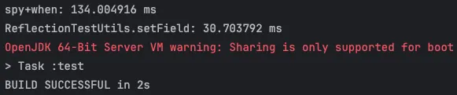

# 목차

# Test Fixture란?

**Test Fixture**는 테스트를 수행하기 전에 필요한 상태나 환경을 설정하는 것을 의미한다.

테스트 수행을 위한 테스트 데이터 자체나 그 데이터를 생성하는 작업을 통틀어서 Test Fixture라고 부르기도 한다.

테스트를 위한 데이터베이스 연결 작업, API 서버 연결 작업 등도 Test Fixture에 포함되긴 하지만 여기서는 테스트 데이터를 중심으로 다루려고 한다.

# Test Fixture 생성 전략

## 테스트 데이터 직접 생성

1. **테스트마다 Fixture 생성**
    
    가장 무식한 방법이다. 그냥 각 테스트마다 그 테스트에서 사용할 데이터를 그때그때 만들어 사용하는 방식이다.
    
    테스트 케이스가 하나라면야 상관없지만, 실제 테스트 코드 작성 환경에서 그럴 일은 없으므로 여러 테스트 케이스마다 중복되는 테스트 데이터들이 발생해 코드가 지저분해지고 유지보수도 어려워진다.
    
2. **setUp(@BeforeEach)로 테스트 데이터 통합하기**
    
    각 테스트 케이스별로 테스트 시작전에 수행할 로직을 명시하는 @BeforeEach 부분에 테스트 데이터 생성 과정을 넣어 중복된 테스트 데이터를 최소화시키는 방법이다.
    
    현재 내가 사용하고 있는 방식이다.

---

테스트 데이터를 미리 만들어놓고 테스트 케이스에서 사용하는 방식은 직관적이지만 몇가지 단점들이 있다.

한 테스트 케이스에서 같은 종류의 테스트 데이터를 여러개 생성하려고 할 때는 테스트 케이스에서 추가적인 테스트 데이터 생성 과정이 필요하며, 이에 따라 코드가 복잡해질 가능성이 있다.

그리고 `@BeforeEach`로 테스트 데이터를 생성하는 과정을 여러 테스트 케이스에 대해 공통적으로 정의할 때, `@BeforeEach`에 해당하는 부분을 수정하기 쉽지 않다는 점도 있다.

해당 부분을 수정하면 모든 테스트 케이스에 대해서 문제가 없다는 것을 확인해야 하거나 몇몇 테스트 케이스를 수정해야 하기 때문이다.

따라서 대부분의 상황에서 테스트 코드 내에서 테스트 데이터를 직접 생성하는 부분을 작성하지 않고, **테스트 데이터를 생성하는 메서드를 호출**하여 각 테스트 케이스에서 알맞게 테스트 데이터를 구성하는 방법을 사용한다.

## 테스트 데이터를 생성하는 메서드 구현

1. **테스트 클래스 내에 테스트 데이터를 생성하는 private 메서드를 구현**
    
    테스트 데이터를 생성하는 메서드를 사용함으로써 여러개의 테스트 데이터를 생성할 일이 생겨도 코드를 길게 작성할 필요 없이 원하는대로 생성할 수 있게 된다.
    
    그리고 각 테스트 케이스에서 상황에 맞게 다른 내용으로 테스트 데이터를 구성할 수 있게 되므로 자율성과 유지보수성이 향상된다.
    
2. **Test Fixture를 담당하는 외부 클래스를 따로 만들고 해당 클래스의 static 메서드로 구현**
    
    만약 어떤 종류의 테스트 데이터를 여러 테스트 클래스에서 사용한다면 테스트 데이터 생성 메서드를 외부로 분리시켜 클래스의 static 메서드로 바꾸는 방법을 사용할 수 있다.
    
    이를 통해 여러 테스트 클래스에 private 메서드를 하나씩 만들어줄 필요가 없어진다.

# Test Fixture로 만든 테스트 데이터의 필드를 변경하려면?

내가 갑자기 Test Fixture에 대해 조사한 이유는 테스트 데이터에 별도의 id값을 할당하는데 어려움을 겪었기 떄문이다.

현재 진행중인 Spring Boot 프로젝트에서는 엔티티의 id값을 @GeneratedValue를 사용해 JPA가 자동으로 구성하게끔 해 놓았다.

그리고 엔티티 데이터의 명확한 관리를 위해 @Setter를 지양하고 생성자에도 필요한 값만 들어가도록 만들었는데, 이런 점 때문에 테스트 데이터의 id값을 임의로 구성할 수 없게 되었다.

기존 엔티티 구성을 바꾸어 id값의 수정을 허용해야 할지 다른 방법을 찾아봐야 할지 고민하던 도중, Test Fixture 생성 메서드를 Mockito의 spy()로 감싸 **getId가 호출될 때 임의의 id값을 넘기도록 stub을 적용**하는 방법을 찾았다.

```java
class ParticipantTest {
    private Member member;

    @BeforeEach
    void setUp() {
        member = Mockito.spy(Fixture.member());
        when(member.getId()).thenReturn(1L);
    }
}
```

이를 통해 기존 엔티티 구성을 바꿀 필요도 없고 생성한 테스트 데이터의 다른 데이터에는 영향을 주지 않은 채 id값만 임의로 설정할 수 있게 되었다.

하지만 문제가 발생했는데, 테스트 데이터를 만들 때 모두 spy에 when을 적용하여 getId를 stub하면 **getId가 사용되지 않는 테스트는 에러를 발생시키게 된다**는 것이다.

이는 JUnit에서 clean code를 위해 불필요한 stub을 줄이기 위함인데, 모든 테스트에서 getId가 사용되는지 일일이 확인하며 테스트 코드를 작성할 수도 없으니 참 곤란한 상황이 되어버렸다.

대안책으로 `lenient().when(member.getId()).thenReturn(1L);` 처럼 lenient를 사용해 불필요한 stub 에러를 무시하게끔 만들 수 있지만, 썩 좋아보이는 방법은 아닌 것 같다.

---

```java
class ParticipantTest {
    private Member member;

    @BeforeEach
    void setUp() {
        member = Fixture.member();
        ReflectionTestUtils.setField(member, "id", 1L);
    }
}
```

그래서 다른 방법을 찾았다. 이 방법은 Mockito의 spy 대신 java의 **Reflection**을 이용한 것으로, 실제 테스트 데이터 객체의 필드값을 직접 바꾸는 방식으로 작동한다.

실제 필드를 넣어주므로 stub은 발생하지 않고, 이후에 getId가 호출되면 넣어준 id값을 읽어오게 된다.

그러므로 불필요한 stub 에러가 발생할 일이 없다.

## Mockito vs ReflectionTestUtils 성능 비교

이 두 방법 중에서 가장 성능이 좋은 건 무엇일까? 테스트를 한번 진행해 보았다.

```java
@Test
@DisplayName("spy+when과 ReflectionTestUtils.setField의 속도 비교")
void compareSpyWhenAndReflectionSetFieldPerformance() {
    int iterations = 1000;
    long spyWhenStart = System.nanoTime();
    for (int i = 0; i < iterations; i++) {
        Account account = Mockito.spy(AccountFixture.createRandomAccount());
        lenient().when(account.getId()).thenReturn("spyId" + i);
        account.getId(); 
    }
    long spyWhenEnd = System.nanoTime();

    long reflectionStart = System.nanoTime();
    for (int i = 0; i < iterations; i++) {
        Account account = AccountFixture.createRandomAccount();
        ReflectionTestUtils.setField(account, "id", "reflectionId" + i);
        account.getId();
    }
    long reflectionEnd = System.nanoTime();

    long spyWhenTime = spyWhenEnd - spyWhenStart;
    long reflectionTime = reflectionEnd - reflectionStart;

    System.out.println("spy+when: " + spyWhenTime / 1_000_000.0 + " ms");
    System.out.println("ReflectionTestUtils.setField: " + reflectionTime / 1_000_000.0 + " ms");

    assertTrue(true); // 단순 실행용
}
```



놀랍게도 Mockito의 spy+when 방식보다 ReflectionTestUtils를 사용하는 방식이 더 빨랐다.

따라서 id 수정을 위해 ReflectionTestUtils를 사용하는 게 좋아보인다.

# 참조

[테스트 픽스처 올바르게 사용하기](https://jojoldu.tistory.com/611)

[테스트 픽스처(Test Fixture)를 어떻게 만드는 것이 좋은 걸까?](https://velog.io/@langoustine/Test-Fixture)