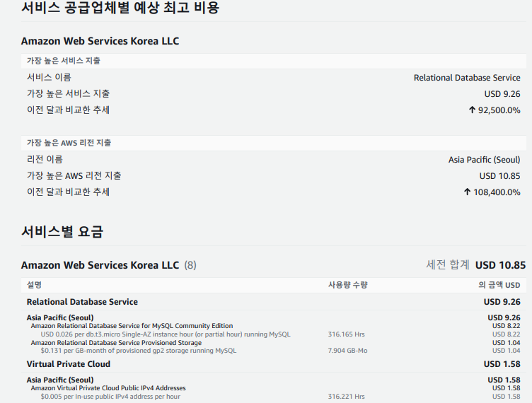

# 목차

# 배운 내용 정리

## AWS의 Resource 서비스

AWS에는 Resource를 관리할 수 있는 다양한 서비스들이 존재한다.

- 컴퓨팅
    - **EC2**
    - Lambda
- 스토리지
    - **S3**
    - EBS
- 데이터베이스
    - **RDS** : RDB
    - DynamoDB: No SQL
- 네트워킹 및 콘텐츠 전송
    - VPC
    - CloudFront

- **RDS** : 관계형 데이터베이스 서비스
- **S3** : 오브젝트/정적 파일  스토리지 서비스

## SQLite3 → MySQL

SQLite3는 동시성 제한, 파일 기반 데이터베이스의 데이터 손실 위험, 복잡한 쿼리 실행 어려움 등의 단점으로 인해 문제가 많았다. 

따라서 배포환경에서는 위의 단점들이 해결되는 서버 형태의 관계형 데이터베이스 관리 시스템(RDBMS)을 사용하는 것이 좋으므로 MySQL로 DB 시스템을 변경하는 것을 추천한다.

## RDS

Amazon Relational Database Service(RDS)는 클라우드에서 간편하게 **데이터베이스**를 **설치**, **운영** 및 규모 조정할 수 있는 관리형 서비스 모음이다. Relational이라는 말처럼 관계형 데이터베이스를 관리하는 서비스다.

## S3

Amazon Simple Storage Service(Amazon S3)는 주로 정적 파일과 미디어 파일들을 저장한다.

S3를 사용하는 이유는 다음과 같다.

- **확장성**: 사용자가 필요한 만큼의 스토리지 용량을 제공. 필요에 따라 용량을 확장 또는 축소.
- **가용성**: 여러 복제본을 생성하고 여러 데이터 센터에 분산 저장하여 사용자게에 빠르게 객체를 전달.
- **보안**: 데이터를 암호화하여 저장하고 전송.

추가적으로 CDN(Content Delivery Network)와 함께 쓴다면 캐싱효과를 누릴 수 있어 사용자가 더 쉽고 빠르게 서비스를 이용할 수 있게 된다.

## Django 세팅

이미지 필드를 사용하기 위해 Pillow 패키지를 설치하고, S3를 사용하기 위해 boto3(Python용 AWS SDK), 다양한 저장소를 사용하기 위해 django-storages를 설치한다.

```json
pip install Pillow boto3 django-storages
```

settings.py를 수정한다.

```python
THIRD_PARTY_APPS = [
    'storages',
]

...

###AWS###
AWS_ACCESS_KEY_ID = get_secret("AWS_ACCESS_KEY_ID") # .csv 파일에 있는 내용을 입력 Access key ID
AWS_SECRET_ACCESS_KEY = get_secret("AWS_SECRET_ACCESS_KEY") # .csv 파일에 있는 내용을 입력 Secret access key
AWS_REGION = 'ap-northeast-2'

###S3###
AWS_STORAGE_BUCKET_NAME = 'lionsession'
AWS_S3_CUSTOM_DOMAIN = '%s.s3.%s.amazonaws.com' % (AWS_STORAGE_BUCKET_NAME,AWS_REGION)
AWS_S3_OBJECT_PARAMETERS = {
    'CacheControl': 'max-age=86400',
}

DEFAULT_FILE_STORAGE = 'storages.backends.s3boto3.S3Boto3Storage' # 장고의 기본 파일저장소 위치를 S3버킷으로 지정.
```

secrets.json에 AWS_ACCESS_KEY_ID, AWS_SECRET_ACCESS_KEY를 추가로 작성한다.

Post에 이미지 필드를 추가하기 위해 다음과 같이 코드를 변경한다.

```python
class Post(BaseModel) :

    CHOICES = (
        ('DIARY', '일기'),
        ('STUDY', '공부'),
        ('ETC', '기타')
    )

    id = models.AutoField(primary_key=True)
    title = models.CharField(verbose_name="제목", max_length=20)
    content = models.TextField(verbose_name = "내용")
    writer = models.CharField(verbose_name="작성자", max_length=10)
    category = models.CharField(choices=CHOICES, max_length=20)
    thumbnail = models.ImageField(null=True, blank=True, verbose_name="썸네일") # 추가
```

# 후기

AWS에서 EC2와 함께 가장 많이 이용할 서비스인 RDS, S3에 대해 배워볼 수 있는 시간이었다.

S3는 이전부터 굉장히 많이 들어보던 서비스였지만 정확히 어떤 상황에 사용되는 서비스인지 몰랐는데, 이미지나 동영상을 저장하는데에 좋은 서비스임을 알 수 있었다.

## 결국 피하지 못한 실수




평소에 AWS 과금에 대해 신중한 입장이라 결제 대시보드도 자주 체크하고 신경을 많이 썼는데, 결국은 사건이 터져버렸다.

내 계정은 만들어진지 12개월이 훌쩍 지나서 AWS 프리티어의 혜택이 사라진 상태였는데, 나는 EC2만 프리티어의 기한이 있다는 것으로 잘못 해석하고 RDS는 평생 프리티어의 혜택을 가진다고 생각했다.

그러나 안타깝게도 RDS는 평생 프리티어가 아니었고, 세션에서 RDS를 만든 후 나는 아무런 걱정 없이 신경을 놓았다. 하필 또 시험기간 도중이라 AWS에 신경을 쓸 여유가 없던 것도 이유였다.

그리고 시간이 좀 지난 뒤 우연히 AWS에 들어갔더니 ~~(이때 못 들어갔으면 ㄹㅇ 10만원 넘겼을 듯…)~~ 위와 같이 돈을 내놓으라는 청구서를 반갑게 맞이할 수 있었다. 😟

다행히 AWS에 싹싹 빌어서 봐달라는 요청을 넣었더니 이번달에 한해서만 환불을 해준다고 해서 그나마 다행이지만, 정말 시험 도중에 소름끼치는 경험을 하게 되었다…

AWS는 기회의 장이기도 하지만 곳곳에 엄청난 함정들이 숨어있으므로 정신을 똑바로 차려야겠다는 교훈을 얻었다…!