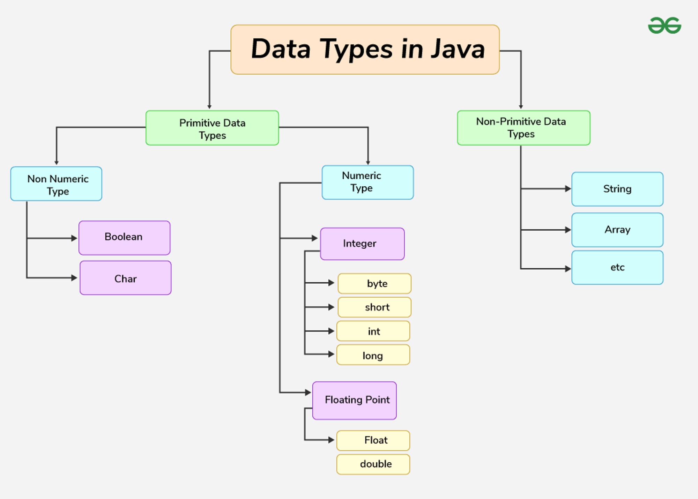

# 목차

# 배운 내용 정리

## Java

### Java란?

Java는 1995년 Sun Microsystems에서 처음 출시된 프로그래밍 언어이자 컴퓨팅 플랫폼이다. Java는 현재까지도 다양한 애플리케이션 개발에 널리 사용되며, 다음과 같은 주요 특징을 가지고 있다.

- **객체 지향 프로그래밍 (Object-Oriented Programming)**: Java는 객체 지향 언어로, 데이터를 객체로 관리하고 조작할 수 있다. 하지만 Java는 순수 객체 지향 언어로 간주되지는 않는다. 기본 데이터 타입(예: `int`, `char` 등)을 지원하기 때문.
- **플랫폼 독립성 ("Write Once, Run Anywhere")**: Java로 작성된 프로그램은 어떤 **운영체제**에서도 실행될 수 있다. Java 프로그램이 바이트코드로 컴파일되고, 이 바이트코드가 JVM에 의해 해석되기 때문이다.
- **C/C++과 유사한 문법**: Java의 문법은 C와 C++의 영향을 받아 유사하지만, Java는 포인터와 같은 저수준 프로그래밍 기능을 제공하지 않는다.

|  | Java | C++ |
| --- | --- | --- |
| 메모리 관리  | 포인터 사용하지 않음. 참조, 스레드, 인터페이스 지원 | 포인터, 구조체, 유니온 사용 |
| 라이브러리 | 다양한 고수준 서비스를 위한 폭넓은 클래스 라이브러리 지원 | (비교적) 저수준 기능 제공 라이브러리 |
| 다중상속 | 인터페이스를 통해 부분적으로 다중 상속 지원 | 단일 상속과 다중 상속 모두 지원 |
| 연산자 오버로딩 | 연산자 오버로딩 지원하지 않음 | 연산자 오버로딩 지원 |
| 프로그램 구조  | 함수와 변수는 클래스 내에만 위치하며, 패키지를 사용 | 함수와 변수가 클래스 외부에 위치할 수 있음 |
| 이식성  | 플랫폼 독립적, 생성된 바이트 코드는 모든 OS에서 실행 가능 | 플랫폼 종속적, 다른 플랫폼에서 사용하려면 다시 컴파일 필요 |
| 스레드 지원 | 내장된 스레드 지원 제공 | 스레드에 대한 내장 지원 없음, 라이브러리에 의존 |

### JVM (Java Virtual Machine)

Java Virtual Machine(JVM)은 Java 프로그램이 실행되는 가상 환경이다. JVM은 운영체제와 무관하게 Java 바이트코드를 실행할 수 있도록 해주며, 이를 통해 Java의 플랫폼 독립성이 실현된다.

### JDK (Java Development Kit)

Java Development Kit(JDK)는 Java 기반의 소프트웨어 애플리케이션과 애플릿을 개발하는 데 필요한 도구와 라이브러리를 제공하는 소프트웨어 개발 환경이다. JDK는 JVM, JRE(Java Runtime Environment), 컴파일러(javac) 및 기타 개발 도구를 포함한다.

## Java 기본 문법

### 자료형

**기본 데이터 타입 (Primitive data)**은 단일 값만을 가지며, 특별한 기능을 가지지 않는다.

**참조 데이터 타입 (Non-Primitive Data Type 또는 Reference Data Types)**은 변수 값의 메모리 주소를 포함한다. 참조 타입은 변수 값을 메모리에 직접 저장하지 않고, 그 값을 가리키는 주소를 저장한다.



### 입출력

표준 입력

```java
import java.util.Scanner; // java.util 패키지 내 존재

public class Main {
    public static void main(String[] args) {
        Scanner scanner = new Scanner(System.in);
        System.out.println("이름을 입력하시오: ");
        String name = scanner.nextLine();
        System.out.println("Hello, " + name + "!");
    }
}
```

표준 출력

```java
public class Main {
    public static void main(String[] args) {
        System.out.println("Hello, World!");
    }
}
```

### 조건문

```java
int number = 10;

if (number > 0) {
    System.out.println("양수");
} else if (number < 0) {
    System.out.println("음수");
} else {
    System.out.println("zero");
}
```

```java
char grade = 'B';

switch (grade) {
    case 'A':
        System.out.println("Excellent!");
        break;
    case 'B':
    case 'C':
        System.out.println("Well done");
        break;
    case 'D':
        System.out.println("You passed");
        break;
    case 'F':
        System.out.println("Better try again");
        break;
    default:
        System.out.println("Invalid grade");
}

```

### 반복문

```java
// for
for (int i = 0; i < 5; i++) {
    System.out.println("Count: " + i);
}
```

```java
// while
int count = 0;
while (count < 5) {
    System.out.println("Count: " + count);
    count++;
}
```

```java
// do-while
int count = 0;
do {
    System.out.println("이거 한번은 출력 됩니다.");
} while (false);

```

## 객체 지향 프로그래밍

### 접근 제어자 (Access Modifiers)

접근 제어자는 클래스, 메서드, 변수 등의 접근 범위를 제한하는 데 사용되는 키워드. 이를 통해 코드를 더 안전하게 만들고, 필요한 부분만 외부에 노출시킬 수 있다. Java에서는 다음과 같은 4가지 접근 제어자를 제공한다:

**1. `public`** 

`public`으로 선언된 클래스, 메서드, 변수는 애플리케이션의 모든 클래스에서 접근할 수 있다.

**2. `protected` (보호)**

같은 패키지 내의 클래스와 해당 클래스를 상속한 서브클래스에서 접근할 수 있다. (서브클래스는 패키지 외부에 있을 수 있음.)

**3. `private` (개인)**

해당 클래스 내부에서만 접근할 수 있다. 클래스 외부나 다른 클래스에서 접근할 수 없으며, 같은 클래스의 다른 인스턴스에서도 접근할 수 없다.

**4. `default` (기본, 패키지 전용)**

아무런 접근 제어자를 지정하지 않으면 `default` 접근 수준이 적용된다. `default`로 선언된 요소는 동일한 패키지 내의 클래스에서만 접근할 수 있으며, 패키지 외부에서는 접근할 수 없다.

### 클래스와 객체

**클래스**는 객체를 만들기 위한 청사진으로, 동일한 유형의 모든 객체가 공유하는 속성과 메서드를 정의한다.

**객체**는 클래스의 인스턴스로, 프로그램에서 실행되는 기본 단위이다. 객체는 상태(속성)와 행동(메서드)으로 구성된다.

```java
class Member {
    String name;
    int generation; // 기수

    public Member(String name, int generation) {
        this.name = name;
        this.generation = generation;
    }

    public void eoheung() {
        System.out.println(name + ": 어흥 🦁");
    }
}

public class Main {
    public static void main(String[] args) {
        Lion newMember1 = new Dog("12기 아기사자", 12);
        newMember1.eoheung();
    }
}
```

### OOP의 네 가지 원칙

- **추상화(Abstraction)**:
    - 불필요한 세부 정보를 숨기고 중요한 정보를 강조하는 개념.
    - Java에서는 인터페이스와 추상 클래스가 추상화를 구현하는 데 사용된다.
    
    ```java
    // 추상 클래스
    abstract class Animal {
        // 추상 메서드 (구현은 하위 클래스에서 제공)
        abstract void sound();
    }
    
    // 구체적인 하위 클래스
    class Dog extends Animal {
        @Override
        void sound() {
            System.out.println("Bark");
        }
    }
    
    public class Main {
        public static void main(String[] args) {
            Animal myDog = new Dog();
            myDog.sound(); // "Bark" 출력
        }
    }
    ```
    

- **캡슐화(Encapsulation)**:
    - 데이터와 그 데이터를 처리하는 코드를 하나의 단위로 묶고, 외부에서 접근을 제한하는 개념이다.
    - 클래스 내의 변수는 `private`로 선언되고, 변수에 접근하기 위한 메서드는 `public`으로 선언하여 데이터를 보호한다.
    
    ```java
    class Person {
        // private 변수 (외부에서 직접 접근 불가)
        private String name;
    
        // public 메서드를 통해 데이터 접근
        public String getName() {
            return name;
        }
    
        public void setName(String name) {
            this.name = name;
        }
    }
    
    public class Main {
        public static void main(String[] args) {
            Person person = new Person();
            person.setName("Alice");
            System.out.println(person.getName()); // "Alice" 출력
        }
    }
    ```
    

- **상속(Inheritance)**:
    - 하나의 클래스가 다른 클래스의 속성과 메서드를 상속받는 기능이다.
    - 상속을 통해 코드 재사용성을 높일 수 있으며, 부모 클래스(슈퍼클래스)의 기능을 자식 클래스(서브클래스)가 확장할 수 있다.
    
    ```java
    // 부모 클래스
    class Animal {
        void eat() {
            System.out.println("This animal eats food");
        }
    }
    
    // 자식 클래스
    class Dog extends Animal {
        void bark() {
            System.out.println("The dog barks");
        }
    }
    
    public class Main {
        public static void main(String[] args) {
            Dog myDog = new Dog();
            myDog.eat();  // "This animal eats food" 출력 (상속받은 메서드)
            myDog.bark(); // "The dog barks" 출력 (자식 클래스의 메서드)
        }
    }
    ```
    

- **다형성(Polymorphism)**:
    - 동일한 이름의 메서드가 서로 다른 형태로 동작할 수 있는 능력이다.
    - **오버로딩(Overloading)**: 같은 이름의 메서드가 다양한 매개변수 집합으로 정의되는 것.
        
        ```java
        class Calculator {
            // 같은 이름의 메서드가 매개변수에 따라 다르게 동작
            int add(int a, int b) {
                return a + b;
            }
        
            int add(int a, int b, int c) {
                return a + b + c;
            }
        }
        
        public class Main {
            public static void main(String[] args) {
                Calculator calc = new Calculator();
                System.out.println(calc.add(2, 3));        // 5 출력
                System.out.println(calc.add(2, 3, 4));     // 9 출력
            }
        }
        ```
        
    - **오버라이딩(Overriding)**: 상속받은 메서드를 자식 클래스에서 재정의하는 것.
        
        ```java
        // 부모 클래스
        class Animal {
            void sound() {
                System.out.println("Animal makes a sound");
            }
        }
        
        // 자식 클래스
        class Cat extends Animal {
            @Override
            void sound() {
                System.out.println("Meow");
            }
        }
        
        public class Main {
            public static void main(String[] args) {
                Animal myCat = new Cat();
                myCat.sound(); // "Meow" 출력 (Cat 클래스의 메서드로 오버라이딩됨)
            }
        }
        ```
        

## 스트림 (Stream)

스트림 API는 Java에서 컬렉션(리스트, 배열 등) 데이터를 더 쉽고 효율적으로 처리할 수 있는 방법을 제공한다. 스트림을 사용하면 데이터를 필터링하거나 정렬하고, 변환하며, 집계하는 작업을 간단하게 할 수 있다.

기존에 데이터를 처리할 때는 `for` 문이나 `Iterator` 를 사용했지만, 코드가 길어지고 데이터 타입마다 다른 방식으로 코드를 작성해야하는 단점이 존재했다. 스트림을 사용한다면 데이터가 읽기 전용으로 처리되며, 데이터를 가공할 때 원본 데이터를 변경하지 않고 새로운 결과를 만들어낼 수 있다. 기존 방식보다 간결한 코드로 작성이 가능하고 여러 함수를 조합(chain)하여 원하는 결과를 쉽게 얻을 수 있다.

기존 방식: 

```java
List<Integer> numbers = Arrays.asList(1, 2, 3, 4, 5, 6);
List<Integer> result = new ArrayList<>();

for (int number : numbers) {
    if (number % 2 == 0) {
        result.add(number * 2);
    }
}

for (int number : result) {
    System.out.println(number);
}
```

스트림 활용:

```java
List<Integer> numbers = Arrays.asList(1, 2, 3, 4, 5, 6);

numbers.stream()
       .filter(n -> n % 2 == 0)
       .map(n -> n * 2)
       .forEach(System.out::println);
```

# 후기

1학기 때 친해졌던 Python을 뒤로하고 Java와 새롭게 친해질 시간이 찾아왔다.

사실 Spring을 써봤던 경험이 있기도 했고, Python의 불편한 패키지 관리와 불안한 동적 타입 때문에 Python은 이미 내 마음에서 떠난지 오래였다…

앞으로 배울 Java와 Spring boot가 매우 기대된다.