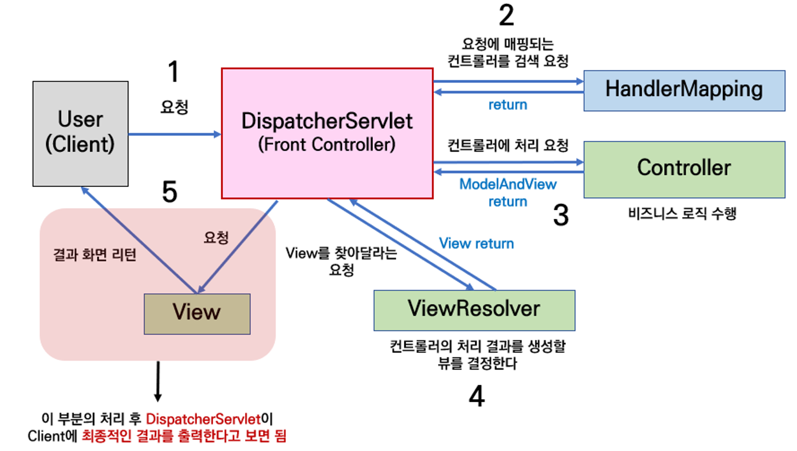

# 목차

# 배운 내용 정리

## Spring 과 SpringBoot

### Spring

- 스프링 프레임워크의 핵심 모듈을 모아서 만든 프레임워크
- 개발자가 **직접 설정 파일**을 작성하여 스프링 컨테이너 구성 / 빈 객체 등록 / 빈 객체 간 의존성 설정해야함

### SpringBoot

- 스프링 프레임워크를 보다 쉽게 사용할 수 있도록 만든 프레임워크
- 개발자가 설정 파일을 작성할 **필요 없이**, 프로젝트의 설정과 라이브러리 의존성을 **자동으로 처리**해주는 기능을 제공
- JAR 파일을 만들수 있음
- 내장형 서버를 제공
    - 스프링 애플리케이션은 일반적으로 톰캣과 같은 WAS에서 배포
    - 스프링 부트는 WAS를 자체적으로 가지고 있기 때문에 jar파일만 만들면 WAS를 설정하지 않아도 애플리케이션 실행이 가능!

>💡 **용어 정리**
>
>- 스프링 컨테이너
>    - 애플리케이션에서 관리되는 객체(빈, Bean)를 생성, 구성, 관리 및 제공하는 역할
>    - 객체 간의 의존성을 관리하고 애플리케이션의 생명주기를 책임짐
>- 빈 Bean
>    - 스프링 컨테이너가 관리하는 객체
>    - 스프링 어플리케이션에 사용 되는 모든 객체가 빈!
>    - 스프링 컨테이너는 애플리케이션이 시작될때, 설정 파일 혹은 어노테이션을 통해 등록된 빈을 생성하고 관리
>    - 스프링 컨테이너가 빈들의 생성, 초기화, 의존성 주입, 소멸 등 생명주기를 관리
>    - 특징
>        - 싱글톤
>            - 하나의 빈 객체만 생성되고 애플리케이션 전반에서 공유됨
>        - XML 파일, 자바 설정 클래스, 혹은 `@Component`, `@Service`, `@Repository`, `@Controller` 같은 어노테이션을 통해 등록
>- 의존성 Dependency
>    - 하나의 객체가 다른 객체를 필요로 하는 관계
>    - PostService가 MemberService라는 클래스가 필요하다면?
>        - PostService가 MemberService에 의존하고 있다~
>- 의존성 주입 Dependency Injection , DI
>    - 스프링이 의존성을 관리하는 방식
>    - 객체가 스스로 필요한 의존성을 생성 X
>    - 스프링 컨테이너가 의존성을 주입해줌
>        - 코드의 결합도가 낮아지고 테스트가 용이해짐
>- JAR
>    - Java Archive의 약자
>    - Java 애플리케이션에서 사용되는 라이브러리, 리소스, 클래스 파일을 압축한 파일 형식
>    - 빌드를 해서 실제로 실행할 수 있는 파일(`.jar`)
>- WAS (Web Application Server)
>    - DB 조회나 다양한 로직 처리를 요구하는 동적인 컨텐츠를 제공하기 위해 만들어진 Application Server
>    - HTTP를 통해 컴퓨터나 장치에 애플리케이션을 수행해주는 미들웨어(소프트웨어 엔진)


### Spring IoC와 DI

- IoC

Inversion of Control의 줄임말로 **제어의 역전**을 의미한다.

```java
# 클래스A 안에서 클래스B 객체를 생성하는 예시
public class A{
	b = new B();
}

# 스프링 컨테이너가 객체를 관리하는 방식
public class A{
	private B b;
}
```

즉 클래스 A안에서 클래스 B 객체를 직접 생성하는 것이 아니고, **외부**에서 **받아오는 방식
외부 == 객체를 관리하는 주체 == 스프링 컨테이너**

- DI

Dependency Injection의 줄임말로 **의존성 주입**을 의미한다. 이는 제어의 역전을 구현하기 위해 사용하는 방법이다.

```java
public class A{
	@Autowired
	B b;
}
```

@Autowired = 스프링 컨테이너에 있는 빈을 주입하는 역할

### Spring AOP와 PSA

- AOP
    - Aspect Oriented Programming의 줄임말
    - 관점 지향 프로그래밍
    - 프로그래밍에 대한 관심을 **핵심 관점**, **부가 관점** 으로 나누어 **모듈화** 하는 것
    - 부가 관점 로직을 모듈화 하여 핵심 관점 코드에서 분리 ⇒ 프로그램의 변경과 확장에 유연하게 대응할 수 있게된다.
- PSA
    - Portable Service Abstraction의 줄임말
    - 이식 가능한 서비스 추상화
    - 스프링에서 제공하는 다양한 기술들을 추상화해 개발자가 쉽게 사용하는 인터페이스
    - 예시
        - 스프링에서 DB에 접근하는 기술(JPA, MyBatis, JDBC) 중 어느 것을 사용하더라도 일관된 방식으로 DB에 접근하도록 인터페이스를 지원
        - 코드 변경 없이 WAS를 톰캣이 아닌 언더토우, 네티에서 실행해도 기존 코드 사용이 가능

### Spring과 SpringBoot의 차이점

- Bean을 사용할 때 기존 Spring에서는 xml 파일에 따로 명시를 해두어야 했지만 SpringBoot에서는 어노테이션 @Bean 등을 이용해 Bean을 손쉽게 사용할 수 있다.

```xml
<!-- applicationContext.xml -->
<beans xmlns="http://www.springframework.org/schema/beans"
       xmlns:xsi="http://www.w3.org/2001/XMLSchema-instance"
       xsi:schemaLocation="http://www.springframework.org/schema/beans
       http://www.springframework.org/schema/beans/spring-beans.xsd">

    <!-- 빈 정의 -->
    <bean id="myService" class="com.example.MyService"/>

    <!-- 의존성 설정 -->
    <bean id="myController" class="com.example.MyController">
        <property name="myService" ref="myService"/>
    </bean>

</beans>
```

```java
#XML이 아닌 자바 설정에서 @Bean 사용하는 방법
@Configuration
public class AppConfig {
    
    @Bean
    public MyService myService() {
        return new MyServiceImpl();
    }
    
    @Bean
    public MyController myController() {
        MyController controller = new MyController();
        controller.setMyService(myService());
        return controller;
    }
}

```

- 기존 Spring에서는 스프링과 연관된 대부분의 설정을 직접 작성해야 했지만, SpringBoot에서는 [`application.properties`](http://application.properties) 나 `application.yml` 을 통해 간단한 설정만 추가하고 대부분의 설정을 스프링에서 자동으로 제공한다.

```java
#대부분의 설정이 자동으로 제공되기 때문에 설정파일을 따로 작성할 필요 X
#필요할 경우에만 application.properties 나 application.yml을 통해 간단한 설정만 추가

#@SpringBootApplication 어노테이션이 붙은 클래스에서 자동으로 스캔하고, 필요한 빈을 자동으로 등록

@SpringBootApplication
public class MySpringBootApplication {
    public static void main(String[] args) {
        SpringApplication.run(MySpringBootApplication.class, args);
    }
}
```

```java
@Service
public class MyService {
    // Service logic
}

@Controller
public class MyController {
    
    private final MyService myService;

    // 의존성 자동 주입
    @Autowired
    public MyController(MyService myService) {
        this.myService = myService;
    }
}
```

## MVC 패턴

장고에서는 MTV 패턴을 사용했다면, 스프링에서는 MVC 패턴을 사용한다.

### Model

- 클라이언트의 요청 사항을 처리하기 위한 작업의 처리 결과 데이터

### View

- Model을 이용하여 웹 브라우저와 같은 애플리케이션의 화면에 보이는 리소스를 제공하는 역할
- Spring MVC의 View 기술
    - HTML 페이지 출력
    - PDF, Excel 등의 문서 형태로 출력
    - XML, JSON등 특정 형식의 포맷으로 전환

### Controller

- 클라이언트의 요청을 직접적으로 전달받는 엔드포인트
- Model과 View 사이의 상호작용 역할
- 클라이언트의 요청을 받아 비즈니스 로직을 거친 후 Model 데이터가 만들어지면, 이 데이터를 View로 전달하는 역할

## Spring MVC 패턴의 전체 흐름



### **DispatcherServlet**

- 클라이언트의 요청을 전달받음
- controller에게 클라이언트의 요청을 전달
- controller 리턴한 결과값을 view에 전달하여 알맞은 응답을 생성
- controller의 controller이기 때문에 front controller라고 불리기도함

### **HandlerMapping**

- 클라이언트의 요청 URL 을 어떤 컨트롤러가 처리할지 결정하는 기능

### **Controller**

- 클라이언트의 요청을 처리한 뒤, 결과를 리턴
- 응답 결과에서 보여줄 데이터를 Model 에 담아 전달
- 컨트롤러에서 나오는 Model은 `HandlerAdpater` 에 의해 `ModelAndView` 로 변환됨

### **ModelAndView**

- Controller 에서 처리한 결과 정보 및 View 선택에 필요한 정보를 담음

### **ViewResolver**

- Model and View 를 전달받은 DispatcherServlet ****은 실제 클라언트에게 보여질 View 를 렌더링하기 위해 어떤 View객체를 사용할지 결정하기 위해 ViewResolver 를 호출

### **View**

- ViewResolver 에 의해 View 객체가 결정되고 해당 객체를 통해 View 를 렌더링

# 후기

이번 세션에서는 Spring과 SpringBoot에 대한 설명 및 차이점, MVC 패턴과 그 흐름에 대해서 배울 수 있었다.

MVC 패턴은 알고 있었지만 스프링 내부에서 MVC 패턴을 따라 어떤 식으로 동작하는지는 정확히 알지 못했는데, 이번 세션에서 확실히 이해할 수 있었다고 생각한다.

이전에 스프링 부트를 공부할 때는 이런 설명들을 들어도 이해가 안되서 대충 넘겨버렸었던 기억이 있는데, 그 후 스프링 부트로 여러 프로젝트를 직접 해보고 이번 세션으로 다시 복습해보니 이전에는 몰랐던 내용이 보이고 이해되는 느낌을 받았다. 지금까지 스프링으로 만들었던 백엔드 시스템이 내부적으로는 이런 방식으로 작동되고 있었음을 알고 나니 감회가 새로웠다.