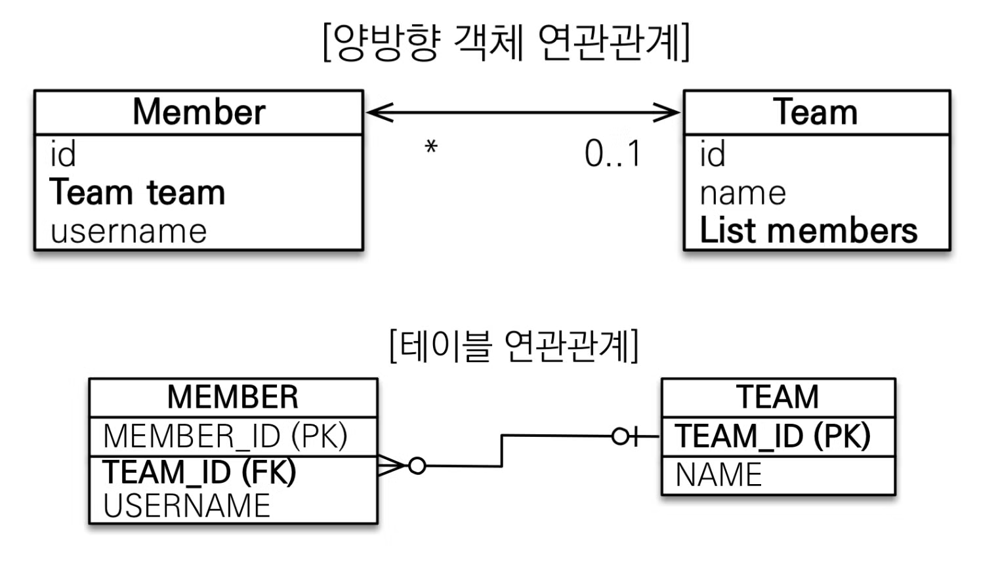

# 목차

# 배운 내용 정리

## ORM 복습


객체 모델과 관계형 데이터베이스 모델 각각이 지향하는 패러다임이 매우 다르기 때문에 이것을 극복하기 위해 객체 모델과 데이터베이스 모델 사이를 매핑해주는 ORM이 등장하게 됨

그리고 Java 진영에서 만들어 낸 ORM이 JPA이다.

## JPA란?


JPA는 Java 애플리케이션과 JDBC 사이에서 동작하는 자바 진영의 ORM 기술 표준이다.

따라서 Member 객체를 저장하기 위해서는 `jpa.persist(member);` 코드 하나만으로

- **Entity 분석**
- **INSERT SQL 생성**
- **JDBC API 사용**
- **패러다임 불일치 해결**

위 과정들을 JPA에서 담당하게 된다.

그리고 Member 객체를 조회하기 위해서는 `jpa.find(memberId);` 코드 하나만으로

- **Entity 분석**
- **SELECT SQL 생성**
- **JDBC API 사용**
- **ResultSet 매핑**
- **패러다임 불일치 해결**

위 과정들을 JPA에서 담당하게 된다.

## 엔티티 매핑

```java
@Entity
@NoArgsConstructor(access = AccessLevel.PROTECTED) // 기본생성자 만들어주는 어노테이션
class Member {
.
.
.
}
```

엔티티의 특징 및 주의사항

- **`@Entity`**가 붙은 클래스는 JPA가 관리함
- **기본 생성자가 필수**
    - 기본 생성자란 파라미터가 하나도 없는 생성자를 의미
- final 클래스, enum, interface, inner 클래스에서는 사용 불가능
- 저장할 필드에 대해 final을 사용해서는 안됨
- `@Entity` 속성에 name을 넣어서 엔티티 이름을 지정할 수 있음 → 다른 패키지에 이름이 같은 엔티티 클래스가 있을 때 별도로 변경
- `@Table` 속성에 name을 넣어서 테이블 이름을 지정할 수 있음

>💡 **데이터베이스 스키마 자동 생성**
>
>저번 스프링 세션에서 application.yml에 추가한 hibernate 옵션이 생각나시나요 ?
>
>application.yml에서 추가한 hibernate.ddl-auto 옵션은 JPA가 제공하는 기능으로 데이터베이스 스키마를 자동으로 생성할 수 있다.
>
>| 옵션 | 설명 |
>| --- | --- |
>| create | 기존 테이블을 삭제하고 새로 생성 → **`Drop + Create`** |
>| create-drop | create 속성에 추가로 애플리케이션을 종료할 때 생성한 DDL을 제거 → **`Drop + Create + Drop`** |
>| update | 데이터베이스 테이블과 엔티티 매핑정보를 비교하여 변경 사항만 수정 |
>| validate | 데이터베이스 테이블과 엔티티 매핑정보를 비교해서 차이가 있으면 경고를 남기고 애플리케이션을 실행하지 않음. 
>이 설정은 DDL을 수정하지 않음. |
>| none | 자동 생성 기능을 사용하지 않으려면 속상 자체를 삭제하거나 유효하지 않은 옵션 값을 주면 됨. |
>- **운영 장비에는 절대 `create`, `create-drop`, `update` 사용하면 안됨**
>- 일반적으로
>    - 개발 초기 단계: `create` `update`
>    - 테스트 서버: `update` `validate`
>    - 스테이징과 운영 서버: `validate` `none`

## 기본 키 매핑

```java
@Entity
@Getter // get+<<attribute명>> 메서드 다 만들어주는 어노테이션
@NoArgsConstructor(access = AccessLevel.PROTECTED) // 기본생성자 만들어주는 어노테이션
public class Member {
	@Id
	@Column(name = "ID")
	private String id;
	...
}
```

**`@Id`**라는 어노테이션을 붙이면 회원의 기본 키를 애플리케이션에서 직접 할당가능

위 예제는 ID를 직접 할당해야 하고, `@GenerateValue` 어노테이션을 사용하면 자동으로 생성시킬 수 있음

이때 자동 생성을 채택하면 다음과 같은 옵션이 존재한다.

1. **IDENTITY** : 기본 키 생성을 데이터베이스에 위임
    - 주로 MySQL, PostgreSQL, SQL Server, DB2에서 사용
    - 데이터베이스에 값을 저장하고 나서야 기본 키를 받을 수 있음.
    - 이 전략은 데이터베이스에 INSERT 한 후에 기본 키 값을 조회할 수 있기 때문에 엔티티에 식별자 값을 할당하려면 추가로 데이터베이스를 조회해야함.
        - Hibernate에 JDBC3에 추가된 Statement.getGeneratedKeys()를 사용해서 Insert만 해도 키 값을 받을 수 있다고 함
    - 엔티티가 영속성 컨텍스트에서 @Id가 붙은 값과 객체가 매핑되어 관리되기 때문에 영속 상태가 되기 위해선 무조건 키 값을 가지고 있어야 하기 때문에 해당 전략을 사용할 경우에는 트랜잭션을 지원하는 쓰기 지연이 동작하지 않는다.
2. **SEQUENCE** : 데이터베이스 시퀀스를 사용하여 기본 키를 할당
    - 주로 Sequence를 지원하는 Oracle, PostgreSQL, DB2에서 사용
    - DB에서 Sequence를 생성 후에 사용
        
        ```sql
        CREATE SEQUENCE MEMBER_SEQ START WITH 1 INCREMENT BY 1;
        ```
        
    - 해당 전략은 **`em.persist()`** 호출 전에 먼저 DB Sequence를 먼저 조회하여, 조회한 식별자를 Entity에 할당한 후 Entity를 영속상태로 저장한다고 한다. 그 후 Transaction을 commit하여 flush가 발생할 때 해당 엔티티를 저장
3. **TABLE** : 키 생성 테이블을 사용
    - Key 생성 전용 Table을 생성하고, name, value로 사용할 column을 생성하여 DB Sequence를 흉내내는 전략.
    - 대략적인 내부 동작 방식은 Sequence와 비슷하나 값을 조회하면서 Select SQL 한번, 값 증가를 위해 Update SQL를 한번 실행하여, DB와 한번 더 통신한다는 점에서 차이가 있다고 한다.
4. **AUTO** : 자동
    - DB 방언에 따라 자동으로 전략을 선택.
    - 해당 전략을 선택할 경우, DB를 변경해도 전략을 수정하지 않아도 된다는 장점이 있음

## 연관관계 매핑

### 단방향 연관관계


위와 같이 한쪽에서만 참조하는 것을 단방향 관계라고 한다.

그러나 방향은 객체관계에서만 존재할 뿐 테이블 관계에서는 **항상 양방향**이다.

이렇게 다른 관계 패러다임을 가진 객체와 테이블을 매핑하기 위해 JPA는 **`@JoinColumn`**과 **`@ManyToOne`**이라는 어노테이션을 이용하여 매핑을 진행한다.

```java
@Entity
public class Member {
	@Id @GeneratedValue
	@Column(name = "MEMBER_ID")
	private Long id;
	
	private String username;
	
	@ManyToOne
	@JoinColumn(name="TEAM_ID")
	private Team team;
}

@Entity
public class Team {
	@Id @GeneratedValue
	@Column(name="TEAM_ID")
	private Long id;
	
	private String name;
}
```

`@ManyToOne` 은 다대일 관계라는 매핑 정보를 가리키고, `@JoinColumn(name=”<외래키 필드명>”` 은 외래키 이름을 지정할 수 있게 해준다.

## 양방향 연관관계



```java
@Entity
public class Member {
	@Id @GeneratedValue
	@Column(name = "MEMBER_ID")
	private Long id;
	
	private String username;
	
	@ManyToOne
	@JoinColumn(name="TEAM_ID")
	private Team team;
}

@Entity
public class Team {
	@Id @GeneratedValue
	@Column(name="TEAM_ID")
	private Long id;
	
	private String name;
	
	// 물론 Map, Set 등 다양한 컬렉션을 JPA는 지원합니다.
	@OneToMany(mappedBy = "team")
	private List<Member> members = new ArrayList<>(); 
}
```

양방향 매핑을 위해서는 단방향 연관관계에서 Team 객체에 추가적으로 변경을 진행하면 된다.

`@OneToMany` 는 일대다 관계라는 매핑 정보를 가리키고, 여기서 `mappedBy` 는 객체와 테이블의 패러다임 차이를 극복하기 위해 연관관계의 주인을 설정하는 옵션이다.


객체 연관관계는 Member → Team 하나, Team → Member 하나로 총 두개의 연관관계가 존재하지만, 테이블 연관관계는 Member ↔ Team 하나만 따지기 때문에 패러다임의 차이가 발생하게 된다.

따라서 JPA는 `mappedBy` 로 객체 연관관계에서 두 테이블 중 하나를 **연관관계의 주인**으로 설정해 주인만이 외래키를 관리하고, 주인이 아닌 쪽은 읽기만 가능하도록 설정한다.

정리하자면 `mappedBy` 를 사용하는 테이블은 주인이 아닌 테이블이고, `mappedBy` 에 들어갈 테이블은 주인이 될 테이블을 넣어주면 된다. 


## 즉시 로딩 vs 지연 로딩

특정 엔티티를 조회할 때 그와 관련된 엔티티들까지 전부 가지고 오는 것은 비효율적이다.

이 문제는 엔티티가 실제 사용될 때까지 데이터베이스 조회를 지연하는 방법인 **지연 로딩**을 통해 해결 가능하다.

```java
@Entity
public class Member {
	//....
	@ManyToOne(fetch = fetchType.LAZY) // 또는 fetch = fetchType.EAGER
	@JoinColumn(name = "TEAM_ID")
	private Team team;
}
```

위와 같이 `fetchType.LAZY` 로 fetch 옵션을 설정하면 지연 로딩을 통해 데이터베이스를 조회하게 된다.

참고로 JPA에서는 fetch 옵션을 사용하지 않아도 다음과 같이 default 처리가 되어있다.

- **`@ManyToOne`**, **`@OneToOne`**: 즉시 로딩 (FetchType.EAGER)
- **`@OneToMany`**, **`@ManyToMany`**: 지연 로딩 (FetchType.LAZY)

## 영속성 전이 - CASCADE

특정 엔티티를 영속 상태로 만들 때 연관된 엔티티도 함께 영속 상태로 만들고 싶다면 → **영속성 전이** 기능을 사용하면 된다.

보통 부모 자식 관계에서 부모 엔티티를 저장할 때 자식 엔티티도 함께 저장하거나, 부모엔티티를 삭제할 때 자식 엔티티를 함께 삭제하고 싶을 때 사용한다.

```java
@Entity
public class Article {
		@Id @GeneratedValue
    @Column(name = "article_id")
    private Long id;

    private String title;
    private String content;

    @OneToMany(mappedBy = "article", **cascasde = CascadeType.ALL**)
    private List<Comment> comments = new ArrayList<>();
}

@Entity
public class Comment { // 댓글 엔티티

    @Id @GeneratedValue
    @Column(name = "comment_id")
    private Long id;
    
    private String content;

    @ManyToOne(fetch = FetchType.LAZY)
    @JoinColumn(name = "article_id")
    private Article article;

}
```

위와 같이 cascade 옵션으로 설정할 수 있으며 종류는 다음과 같다.

- `CascadeType.ALL` : 모든 Cascade 옵션을 적용
- `CascadeType.PERSIST` : 엔티티를 영속화할 때, 연관된 엔티티도 함께 영속화
- `CascadeType.REMOVE` : 엔티티를 제거할 때, 연관된 엔티티도 함께 제거
- `CascadeType.MERGE` : 엔티티 상태를 병합할 때, 연관된 엔티티도 함께 병합
- `CascadeType.REFRESH` : 부모 엔티티를 Refresh하면, 연관된 엔티티도 함께 Refresh
- `CascadeType.DETACH` : 부모 엔티티를 Detach하면, 연관된 엔티티도 함께 Detach

# 후기

먼저 머리 아픈 개념인 JPA를 기가막히게 정리해주신 하영님께 무한한 감사를 보냅니다…😭😭

이번 세션에서는 스프링의 중심 요소라고 할 수있는 JPA에 대해 알아볼 수 있었다. 평소에 스프링으로 개발할 때는 구현체인 Hibernate 사용법만 익혀서 JPA가 내부에서 어떻게 동작하는 지는 궁금했지만 쉽게 알 수 없었는데, 이번에 많은 것을 다시 보게 된 것 같다.

특히 이번 세션을 통해 JPA가 “객체와 테이블의 간격을 좁히는” 역할을 위해 만들어진 것이 JPA를 이해하는데 굉장히 중요한 사실이라는 생각이 강하게 들었다. `mappedBy` 옵션이 객체와 테이블의 참조 방법이 다르기 때문에 만들어졌다는 것도 새로 알게 되었다.

그리고 `cascade` 옵션도 원래는 연관된 데이터를 같이 삭제하는 용도로만 이해하고 있었는데, 영속성 전이라는 개념으로 이해해보니 새로운 느낌을 많이 받았다. cascade 종류에도 여러가지가 있다는 것도 알게 되었다.

다만 굳이 양방향 연관관계를 사용해야할까라는 의문이 들었는데, 지금껏 개발했던 경험에서는 자식 엔티티에만 `@ManyToOne` 으로 부모 엔티티와의 관계를 단방향으로 표현해도 전혀 문제가 없었기 때문이다. 양방향 연관관계를 만들기 위해서는 부모 엔티티에 추가적으로 필드를 붙여야 하는데, 이를 통해서 얻을 수 있는 장점이 무엇인지 궁금해졌다.