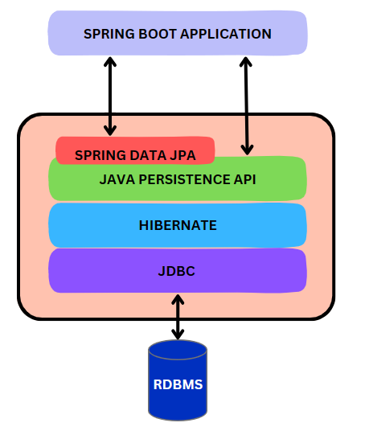

# 목차

# 배운 내용 정리

## Spring Data JPA

- JPA(Java Persistence API)를 더 쉽게 사용할 수 있도록 해주는 도구
- 복잡한 코드를 많이 작성할 필요 없이 간단한 인터페이스만 만들면 Spring이 자동으로 처리해줌.



## Repository 패턴

### JPARepository

- Spring Data JPA가 제공하는 인터페이스
- 다양한 인터페이스로부터 메서드를 상속받고 있음

### CrudRepository

가장 기본적인 CRUD 기능을 제공하는 인터페이스이다.

- `count()`
    - 저장된 엔티티 개수를 반환
- `delete(T entity)`
    - 지정된 엔티티를 삭제
- `deleteAll()`
    - 모든 엔티티를 삭제
- `deleteAll(Iterable<? extends T> entities)`
    - 주어진 여러 엔티티들을 한 번에 삭제
- `deleteAllById(Iterable<? extends ID> ids)`
    - 주어진 ID 리스트에 해당하는 엔티티들을 삭제
- `deleteById(ID id)`
    - 주어진 ID로 엔티티를 삭제
- `existsById(ID id)`
    - 주어진 ID의 엔티티가 존재하는지 확인
- `findById(ID id)`
    - 주어진 ID에 해당하는 엔티티를 조회
- `save(S entity)`
    - 엔티티를 저장 또는 업데이트

### ListCrudRepository

다수의 엔티티를 처리하는 메서드를 제공하는 인터페이스이다.

- `findAll()`
    - 모든 엔티티를 리스트 형태로 반환
- `findAllById(Iterable<ID> ids)`
    - 주어진 ID 리스트에 해당하는 모든 엔티티를 반환
- `saveAll(Iterable<S> entities)`
    - 여러 엔티티를 저장 또는 업데이트

### PagingAndSortingRepository

페이징과 정렬을 위한 메서드를 추가 제공하는 인터페이스이다.

- `findAll(Sort sort)`
    - 주어진 정렬 조건에 따라 모든 엔티티를 반환
- `findAll(Pageable pageable)`
    - 페이징 정보에 따라 모든 엔티티를 반환

### QueryByExampleExecutor

예제(Example) 객체를 사용해 쿼리를 수행할 수 있는 기능을 제공하는 인터페이스이다.

- `count(Example<S> example)`
    - 예제를 기반으로 일치하는 엔티티 개수를 반환
- `exists(Example<S> example)`
    - 예제를 기반으로 일치하는 엔티티가 존재하는지 확인
- `findAll(Example<S> example)`
    - 예제를 기반으로 일치하는 모든 엔티티를 반환
- `findBy(Example<S> example)`
    - 예제를 기반으로 일치하는 특정 엔티티를 반환
- `findOne(Example<S> example)`
    - 예제를 기반으로 일치하는 하나의 엔티티를 반환

### 동일한 메서드 이름의 차이점

- **`findAll()`**
    - `findAll()` in `CrudRepository`
        - 단순히 모든 엔티티를 반환
    - `findAll(Sort sort)` in `PagingAndSortingRepository`
        - 정렬된 결과를 반환
    - `findAll(Pageable pageable)` in `PagingAndSortingRepository`
        - 페이징 처리된 결과를 반환
- **`count()`**
    - `count()` in `CrudRepository`
        - 전체 엔티티의 개수를 반환
    - `count(Example<S> example)` in `QueryByExampleExecutor`
        - 특정 조건을 기준으로 엔티티 개수를 반환

[JpaRepository (Spring Data JPA Parent 3.3.4 API)](https://docs.spring.io/spring-data/jpa/docs/current/api/org/springframework/data/jpa/repository/JpaRepository.html)

## Query Method

아래와 같이 메서드 이름을 통해 자동으로 쿼리를 생성하는 방식이다.

```java
List<User> findByAgeGreaterThanAndNameLike(int age, String namePattern);
```

### 메서드 이름 규칙

1. `And`
    - 여러 조건을 **AND** 연산으로 결합
2. `Or`
    - 여러 조건을 **OR** 연산으로 결합
3. `Between`
    - 필드 값이 두 값 사이에 있는지 확인하는 쿼리를 작성
    
    ```java
    List<Order> findByOrderDateBetween(LocalDate startDate, LocalDate endDate);
    ```
    
4. `Like`
    - 문자열 패턴 매칭을 수행하는 쿼리를 작성
    
    ```java
    List<User> findByFirstNameLike(String pattern);
    ```
    
5. `OrderBy` 
    - 쿼리 결과를 특정 필드로 **정렬**
    
    ```java
    List<User> findAllByOrderByCreatedDateDesc();
    ```
    
6. `First`
    - 첫 번째 결과만 반환하도록 제한
    
    ```java
     User findFirstByOrderByCreatedDateDesc();
    ```
    
7. `GreaterThan`, `GreaterThanEqual`, `LessThan`, `LessThanEqual`
    - 특정 필드가 **크다, 크거나 같다, 작다** 또는 **작거나 같다** 조건을 추가
    
    ```java
    List<Product> findByPriceGreaterThan(Double price);
    ```
    
8. `After`, `Before`
    - **날짜나 시간**을 기준으로 특정 시점 이후나 이전의 데이터를 조회
    
    ```java
    List<Order> findByStartDateAfter(LocalDateTime date);
    ```
    

## @Query

Query Method를 통해 메서드 이름으로 쿼리를 생성하는 방법 말고도 직접 쿼리를 만들 수도 있다.

JPQL 또는 Native Query를 사용할 수 있다.

### JPQL

JPQL로 대부분의 DB와 호환되는 쿼리를 작성할 수 있다.

```java
@Query("SELECT u FROM User u WHERE u.name = ?1")
Optional<User> findByName(String name);

@Query("SELECT u FROM User u WHERE u.name = :name")
Optional<User> findByName(@Param("name") String name);
```

### Native Query

**nativeQuery** 옵션을 true로 설정해주면, JPQL이 아닌 실제 SQL을 사용할 수 있다.

단, 현재 사용 중인 DB와 호환되는 SQL을 사용해야 한다.

```java
@Query(value = "SELECT * FROM users WHERE name = ?1", **nativeQuery = true**)
Optional<User> findByName(String name);

@Query(value = "SELECT * FROM users WHERE name = :name", **nativeQuery = true**)
Optional<User> findByName(@Param("name") String name);
```

## 페이징

대량의 데이터를 한 번에 처리하지 않고, 일정한 크기로 나눠서 필요한 만큼의 데이터를 가져오는 기법

```java
import org.springframework.data.domain.Page;
import org.springframework.data.domain.PageRequest;
import org.springframework.data.domain.Pageable;
import org.springframework.data.domain.Sort;

public Page<Post> getPosts(int page, int size) {
        Pageable pageable = PageRequest.of(page, size, Sort.by("name").ascending());
        return postRepository.findAll(pageable);
    }
```

### `Page<T>`

`Page<T>` 객체는 페이징된 데이터를 포함하고, 추가적으로 아래와 같은 정보를 제공한다.

- **getContent()**
    - 해당 페이지의 실제 데이터 리스트를 반환.
- **getTotalElements()**
    - 전체 데이터의 개수.
- **getTotalPages()**
    - 전체 페이지 수.
- **getNumber()**
    - 현재 페이지 번호.
- **getSize()**
    - 페이지 크기 (한 페이지에 포함된 데이터의 수).

### PageRequest

`PageRequest` 클래스를 사용하여 `Pageable` 객체를 생성한다.

이때, 3가지 파라미터를 전달해줄 수 있다.

1. 현재 page
2. 한 page의 크기 (데이터 수)
3. 정렬 기준

## Optional

Java 8 에서 도입된 클래스로, `null` 값을 안전하게 처리하고, 값이 없을 때의 상황을 명시적으로 처리할 수 있게 해준다.

### Optional이 제공하는 기능

1. NullPointerException 방지
    - `null`을 직접 처리할 필요가 없으며, 값이 없는 상황을 명시적으로 처리할 수 있다.
    
    ```java
    public String getUserName(User user) {
        return Optional.ofNullable(user)
                       .map(User::getName)
                       .orElse("Unknown");
    }
    
    ```
    
2. 값이 있는지 여부 확인
    - `isPresent()`
    - `ifPresent()`
    
    ```java
    public void printUserIfPresent(User user) {
        Optional.ofNullable(user)
                .ifPresent(u -> System.out.println("User name: " + u.getName()));
    }
    ```
    
3. 값이 없을 때 별도 처리
    - `orElse()`
    - `orElseThrow()`
    
    ```java
    public User findUserById(Long id) {
        return userRepository.findById(id)
                             .orElseThrow(() -> new UserNotFoundException("User not found with id: " + id));
    }
    
    ```
    

# 후기

이번 세션에서는 JPA를 더 쉽게 사용할 수 있게끔 도와주는 Spring Data JPA에 대해 배워보았다.

저번 세션에 사용했던 EntityManager는 기본적인 JPA이기 때문에 실제 서비스 개발에서 사용하기에는 번거로운 과정들이 매우 많이 필요했었는데, Spring Data JPA는 리플렉션을 이용해 별도의 코드 작성 없이도 ORM을 사용할 수 있게 도와주기 때문에 정말 좋은 기능인 것 같다.

페이지네이션도 제로부터 구현하려면 참 막막한 기능인데 이미 구현되어 있어 편하게 사용할 수 있는 것도 참 좋은 것 같다.

스프링 개발중에 Optional을 전략적으로 사용하는 방법에 대해 궁금한 점들이 많다. 스프링으로 개발하다 보면 정말 Null과의 싸움이라 말할 정도로 Null 예외처리를 신경써서 해야한다. 특히 데이터베이스 구조가 프로젝트 후반부로 가면서 점점 복잡해지고 커질수록 Null을 다루는 것이 힘들어지는데, Optional을 제대로 사용한다면 어떻게 해결할 수 있지 않을까?