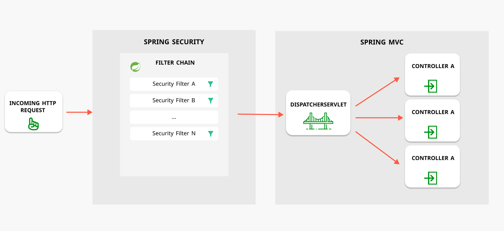

# 목차

# 배운 내용 정리

## Spring Security란

- Spring 애플리케이션에서 인증/인가를 처리하기 위한 강력한 보안 프레임워크
- Spring Boot와 통합이 원활하여 최소한의 설정만으로 기본적인 보안 기능을 손쉽게 구현 가능

## Spring Security 기본 구조

### Filter

HTTP Request가 Controller에 매핑되기 전에 통과해야 하는 로직들로, 일종의 미들웨어이다.

여러 Filter들이 이어져 있는 구조를 Filter Chain이라고 칭한다.

### AuthenticationManager

사용자가 제공한 인증 정보를 받아 인증을 시도하는 역할을 하며, `AuthenticationProvider`들이 모여 인증 처리를 수행한다.

요청된 인증을 확인하는 과정에서 `authenticate()` 메서드를 호출해 사용자 정보가 유효한지 검증한다.

### AuthenticationProvider

실질적인 인증 작업을 수행하는 객체이며, 기본 제공 구현체도 있고 커스텀도 가능하다.

### SecurityContextHolder

**스레드** 별 ****SecurityContext를 보관하고 제공한다.

비동기 작업이나 멀티스레드 환경에서도 각 스레드가 독립적인 보안 정보를 가지도록 한다.

### SecurityContext

Authentication의 상태를 관리하고 다양한 형태의 Authentication 구현체를 지원한다.

### Authentication

- 사용자의 인증 정보를 나타내는 **인터페이스**
- 사용자 이름, 비밀번호, 권한 등의 정보를 포함
- 기본적으로  `UsernamePasswordAuthenticationToken` 라는 구현체가 제공 됨 (기본 폼 로그인 용도)
- 필요에 따라 커스텀 가능
- Credentials → 사용자가 제공한 자격 증명 (비밀 번호, 토큰 등)
- Autorities → 사용자의 권한 정보

### UserDetails

사용자의 인증 및 권한 정보를 담고 있는 인터페이스이며, Authentication의 Principal 로 사용된다.

### UserDetailsService

사용자 정보를 가져오는 역할을 수행하고, 단일 메서드 `loadUserByUsername()` 을 통해 `UserDetails` 객체를 반환한다.

## 세션 기반 인증

## 세션

클라이언트와 서버 간의 **연결 상태.**

즉, 사용자와 사용자 연결에 대한 정보의 집합.

기본적으로 다음과 같은 정보들을 포함하고 있으며, 추가적인 정보를 함께 저장할 수 있다.

- 세션 ID
- 세션 생성 시각
- 세션에 대한 마지막 접근 시각

## 쿠키

브라우저가 제공하는 데이터 저장소들 중 하나.

다음과 같은 특징을 갖고 있다.

- 약 4KB의 데이터 저장 가능
- 만료일 설정 가능
    - 만료일 미설정 시, 브라우저를 닫을 경우 함께 삭제
- HTTP 요청 시, 자동으로 서버에 전송됨
- Secure, HttpOnly 등 옵션을 통해 보안 설정 가능
    - JS로 접근할 수 없게 함.

# 후기

이번 세션에서는 Spring Boot에서 가장 어렵고 좌절스러운 부분인 Spring Security 부분을 다루었다.

사실 개발 경험이 정말 많이 쌓이지 않는 이상 Spring Security 구조를 100% 이해하는 것은 불가능하다고 생각한다. 그 복잡함도 복잡함이지만 구현되어 있는 내부 구조들이 너무 많기 때문이다.

몇번 Spring Security로 로그인을 구현해본 적이 있는데, Spring Security를 사용할 때 가장 중요한 것은 구현에 필수적으로 필요한 부분만 가져다 사용하거나 추가로 구현하는 능력이라고 생각한다. 구현에 급급해 블로그나 gpt를 사용하여 얻은 코드가 무엇에 쓰이는지도 이해하지 못한채 이것저것 사용하게 되면 나중에 자신의 코드를 이해할 수 없는 불상사가 벌어질 것이다.

결국 Spring Security에 최대한 의존하지 않는 것이 오히려 그것을 더 잘 사용하는 방법이라는 생각이 든다. 추후 더 많은 개발을 통해 어떤 구조가 내 구현 목적을 위해 필요한지 확실하게 파악할 수 있는 능력을 가지고 싶다.