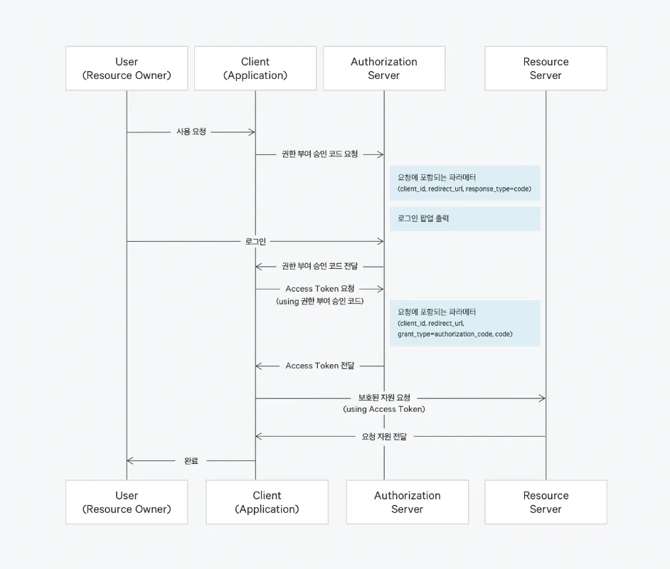
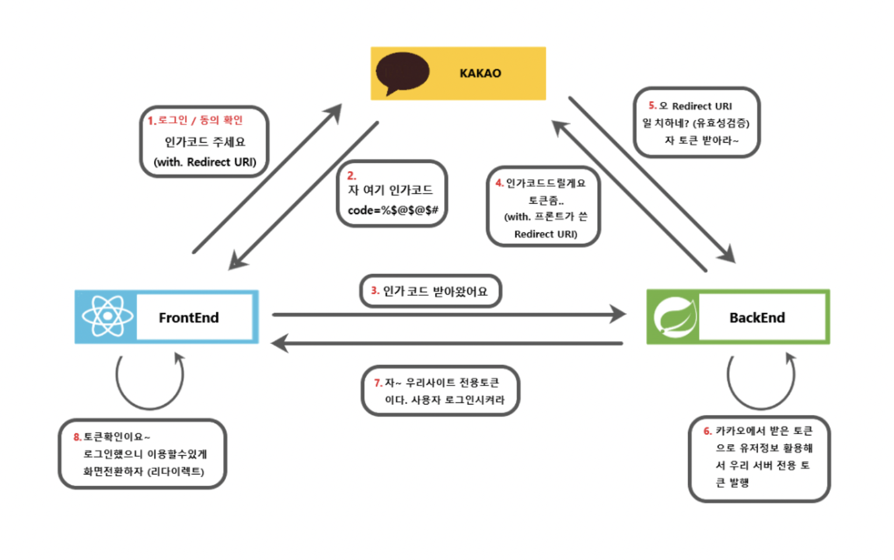

# 목차

# 배운 내용 정리

## Google OAuth2.0 절차



1. **사용자 인증 요청**: 사용자가 Google 계정을 통해 인증을 요청.
2. **승인 코드 발급**: Google이 사용자에게 로그인 화면을 제공하고, 사용자가 로그인하면 승인 코드를 전달.
3. **Access Token 발급**: 승인 코드를 Google에 전달하여 Access Token을 발급받음.
4. **Resource Access**: 발급받은 Access Token을 이용하여 사용자 정보를 Google API로부터 가져옴.
5. **토큰 검증 및 사용**: Access Token을 사용하여 보호된 리소스에 접근하고, 이를 통해 인증된 사용자를 확인.

## Spring Boot에 OAuth 적용

### SpringSecurity

```java
@Configuration
@EnableWebSecurity
@RequiredArgsConstructor
public class SecurityConfig {
    private final CustomUserDetailsService customUserDetailsService; // 일반 로그인 처리를 위한 CustomUserDetailsService
    private final CustomOAuth2UserService customOAuth2UserService; // OAuth2 로그인을 처리할 CustomOAuth2UserService
}
```

`CustomOAuth2UserService`: Google 로그인 시 Google로부터 받은 정보를 바탕으로 회원 가입 또는 사용자 정보 업데이트를 처리하는 서비스.

`CustomUserDetailsService`: 일반 로그인 처리에 필요한 서비스로, 사용자의 자격 증명을 확인하는 역할.

어노테이션

- `@Configuration`: Spring Security 설정을 위한 구성 클래스임을 나타냄.
- `@EnableWebSecurity`: Spring Security의 웹 보안 설정을 활성화.

### SecurityFilterChain

```java

  @Bean
  public SecurityFilterChain filterChain(HttpSecurity http) throws Exception {
      http
          
          .oauth2Login(oauth2Login ->
              oauth2Login
                  .loginPage("/login") // 사용자 정의 로그인 페이지 설정
                  .userInfoEndpoint(userInfoEndpoint -> 
                      userInfoEndpoint.userService(customOAuth2UserService())
                  )
                  .successHandler((request, response, authentication) -> {
                      // OAuth 로그인 성공 후 토큰을 확인하고 사용할 수 있는 곳
                      OAuth2AuthenticationToken authToken = (OAuth2AuthenticationToken) authentication;
                      OAuth2User oAuth2User = authToken.getPrincipal();
                      String accessToken = authToken.getAuthorizedClientRegistrationId();
                      System.out.println("Access Token: " + accessToken);
                      response.sendRedirect("/");
                  })
          );
      return http.build();
  }

  @Bean
  public CustomOAuth2UserService customOAuth2UserService() {
      return new CustomOAuth2UserService();
  }
```

- `oauth2Login`: Google OAuth 2.0 로그인을 활성화하고, `userService`에 커스텀 사용자 정보를 처리하는 `CustomOAuth2UserService`를 등록.
- **`userInfoEndpoint`**:
    - OAuth2 로그인에서 Google이 인증을 완료하면, Google은 백엔드에 사용자 정보를 반환한다.
    - `userInfoEndpoint.userService(customOAuth2UserService())`를 통해 반환된 사용자 정보를 `CustomOAuth2UserService`가 처리하도록 설정.
- `successHandler`: 인증 성공 시 액세스 토큰을 확인하고 사용할 수 있다.
    - 사용자가 로그인에 성공했을 때 호출된다.
    - `OAuth2AuthenticationToken`에서 인증된 사용자(`OAuth2User`) 정보를 가져오고, 이를 바탕으로 액세스 토큰 등 필요한 정보를 확인할 수 있다.

### CustomOAuth2UserService

```jsx
@Service
public class CustomOAuth2UserService extends DefaultOAuth2UserService {
    
    @Autowired
    private MemberJpaRepository memberRepository;

    @Override
    public OAuth2User loadUser(OAuth2UserRequest userRequest) throws OAuth2AuthenticationException {
        OAuth2User oAuth2User = super.loadUser(userRequest);

        String email = oAuth2User.getAttribute("email");
        String name = oAuth2User.getAttribute("name");

        // 상황에 맞는 로직. DB에서 사용자 확인 또는 저장
        
    }
}

```

- `CustomOAuth2UserService` :
    - `DefaultOAuth2UserService`를 상속하여, Google 로그인 후 반환된 사용자 정보를 커스터마이징하여 처리하는 서비스.
    - 기본 OAuth2 사용자 서비스의 기능을 확장한다.
    - Google OAuth 로그인 후 사용자 정보를 가져와, DB의 회원 정보와 연동하는 기능을 구현.
- 구글 사용자 정보 로드:
    - `super.loadUser(userRequest)`를 호출하여 Google로부터 사용자 정보를 가져옴.
    - `OAuth2UserRequest`는 Google OAuth 서버와의 통신을 통해 사용자 정보에 접근할 수 있는 `OAuth2User` 객체를 생성한다.
- `oAuth2User.getAttribute("")`: 알고싶은 사용자 정보.
- `DefaultOAuth2User` **생성 후 반환**:
    - Google 로그인 성공 후 `DefaultOAuth2User` 객체를 반환하여 인증이 완료된 사용자로 인식하게 한다.
    - 반환된 `DefaultOAuth2User` 객체는 Spring Security에서 인증된 사용자로 처리되어 이후 애플리케이션에서 인증이 필요한 작업을 수행할 수 있다.

## SpringBoot의 OAuth 인증방식 비교

`access token`을 직접 받아 처리하는 방법과 `Spring Security`를 이용한 방식으로 두 가지 방법이 있다.

### 기존 방식

```java
public Map<String, Object> getUserInfo(String accessToken) {
    RestTemplate restTemplate = new RestTemplate();
    String url = "https://www.googleapis.com/oauth2/v3/userinfo";

    HttpHeaders headers = new HttpHeaders();
    headers.setBearerAuth(accessToken); // Access token을 이용한 인증

    HttpEntity<String> request = new HttpEntity<>(headers);
    ResponseEntity<Map> response = restTemplate.exchange(url, HttpMethod.GET, request, Map.class);

    return response.getBody();
}
```

Spring에서 직접 구글에서 받은 access token을 다루어 사용자 정보를 가져오는 방법

→ 그러나 직접 코드를 구현해야 한다는 점에서 번거롭고 보안 위험이 존재할 수 있다

### Spring Security에서 처리

사용자가 로그인 버튼을 클릭할 때 Spring Security가 access token을 받고 그것을 이용해 사용자 정보를 가져오는 과정을 대신 수행해준다

→ 직접 코드를 구현할 필요 없고 안전함이 보장된 방법

## OAuth2 인증 및 토큰 확인 과정 (with 프론트)



백엔드에서는 :

1. **사용자 로그인 요청**: 사용자가 프론트엔드에서 Google 로그인 버튼을 클릭.
2. **Google 인증**: 사용자가 Google 계정으로 인증을 완료하면, Google은 `redirect_uri`로 인증 코드를 보낸다.
3. **Access Token 발급**: 이 인증 코드를 Google 서버로 보내고, Access Token을 발급받는다.
4. **사용자 정보 요청**: Spring Boot는 이 Access Token을 사용하여 Google 사용자 정보(API)에서 이메일, 이름 등의 정보를 가져온다.
5. **DB에 사용자 정보 저장**: Google에서 가져온 사용자 정보로 서비스에 맞게 활용한다. (DB에서 사용자를 찾고, 새로운 사용자면 저장하거나, 기존 사용자 정보를 업데이트)
6. **토큰 검증 및 리디렉션**: Access Token을 통해 인증된 사용자로 시스템에 접근할 수 있으며, 성공 후 지정된 URL로 리디렉션한다.

# 후기

이번 세션에서는 OAuth2 로그인을 스프링 부트에 적용하는 방법에 대해 배워보았다.

최근에는 ID-PW 로그인 방식이 거의 사라지고 모든 로그인 방법이 OAuth를 사용하는 방법으로 대체되는 추세인데, 그만큼 이번 세션 내용이 중요하다는 뜻이 될 것이다.

OAuth2는 프론트엔드와 백엔드 말고도 인증 서버(Authorization Server)가 추가된 구조를 형성하고 있는데, 이것 때문에 이해하는데 골치가 많이 아팠었다. 그리고 OAuth2를 구현하는 방법이 다양하다보니 (ex. 인가코드를 프론트엔드에서 받음 vs 백엔드에서 받음) 어느게 맞고 틀린건지도 많이 햇갈렸던 기억이 난다.

SecurityFitlerChain을 커스텀하여 Spring Boot가 직접 OAuth2 인증을 대신 처리해주는 방법은 이번에 처음 알게 되었는데, 굉장히 안전하고 간편한 구현이 가능해지는 좋은 기능이라고 생각했다. 그러나 최근에는 React 같은 프론트엔드와 같이 개발되기 때문에 많이 쓰이진 않을 것이라는 생각도 들었다.

아직도 OAuth2의 흐름을 줄줄 읊을 정도로 완벽히 마스터한 건 아니지만, 이번 세션으로 OAuth2에 대한 생각이 정리된 것 같아 만족스러웠다. 아마 앞으로의 프로젝트에서 몇번 더 로그인을 개발해보면 충분히 마스터할 수 있을 것이라 본다 :)