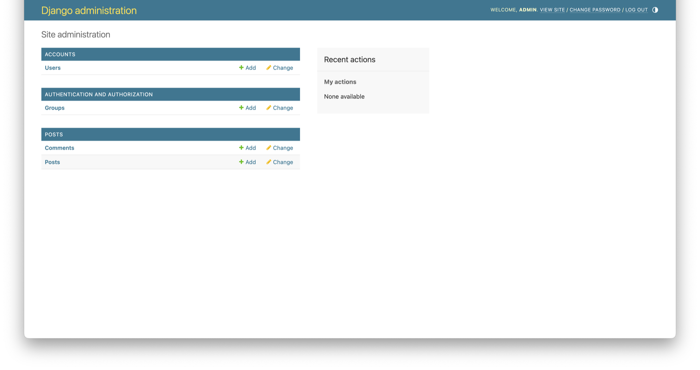

# 목차

# 배운 내용 정리

## 데이터

- 스키마 : 같은 데이터여도 해석하는 방향이 다르다면 문제가 생기기 때문에, 데이터에 대한 명확한 정의를 내리고 그 구조를 기술한 것을 스키마라고 한다.

데이터 형식에 따라 구분을 지을 수도 있다.

| 구분 | 내용 | 저장유형 | 데이터 구조 |
| --- | --- | --- | --- |
| 정형데이터 (Structured Data) | 미리 정의된 형식이 있는 데이터 | RDBMS | Entity-Relationship |
| 반정형데이터 (Semi-Structured Data) | 데이터의 구조 정보를 데이터와 함께 제공하는 파일 형식의 데이터 → 데이터의 형식과 구조가 변경될 수 있는 데이터 | NoSQL | Key-Value 등 |
| 비정형데이터 (Unstructured Data) | 미리 정의된 형식이 없는 데이터 | 비구조 | Non Structure |

## 데이터베이스(DB)

여러 사람이나 프로그램이 데이터를 쉽게 공유하기 위해 체계적으로 관리되는 데이터의 집합을 데이터베이스라고 한다. 크게 RDB와 NoSQL로 나뉜다. 여기서는 RDB에 대해 다룬다.

### RDB

다음과 같이 excel 형식과 비슷한 테이블 형태의 데이터베이스를 **관계형 데이터베이스(RDB)** 라고 한다.

| id | 이름 | 학과 | 나이 |
| --- | --- | --- | --- |
| 1 | 이OO | 에너지시스템공학부 | 25 |
| 2 | 민OO | 소프트웨어학부 | 25 |
| 3 | 최OO | 사회학부 | 23 |
| 4 | 한OO | 소프트웨어학부 | 24 |
| 5 | 배OO | 소프트웨어학부 | 22 |
- 위와 같이 행과 열로 표현된 데이터를 `Table` 또는 `Entity` 라고 한다.
- 각 행( `Row` )의 데이터들을 `Record` 또는 `Tuple` 이라고 부른다.
- 각 열( `Column` )의 데이터들을 `Field` 라고 하며, Column 이름의 집합을 `Attribute` 라고 한다.

---

**Primay Key(고유 키)** 는 튜플을 식별할 수 있게 만드는 가장 작은 subset중에서 선택한 것이고,

**Foreign Key(외래 키)** 는 2개의 엔티티에서 서로 **참조 관계일 때 사용하는 key이다.**

Foreign Key로 맺는 참조 관계에는 3종류가 있다.

- 일대일(1:1) 관계
    - 어느 엔티티 쪽에서 상대 엔티티와 **반드시 단 하나의 관계**를 가지는 것을 의미한다.
    
    
    

- 일대다(1:N) 관계
    - **한 쪽** 엔티티가 관계를 맺은 엔티티 쪽의 **여러 객체**를 가질 수 있는 것을 의미한다.
    
    
    

- 다대다(N:M) 관계
    - 관계를 가진 **양쪽 엔티티 모두**에서 1:N 관계를 가지는 것을 의미한다.
    
    
    

<aside>
💡 **다대다(N:M) 관계의 관리**

다대다 관계는 두 테이블의 대표키를 컬럼으로 갖는 또 다른 테이블을 생성해서 관리한다.
그 이유는 RDB의 성질을 보존하기 위함이다.

아래의 데이터베이스는 왼쪽이 학생 테이블이고, 오른쪽이 강의 테이블이다.

서로의 테이블이 상대의 PK를 자신의 FK로 들여오면 학생 테이블에는 동일한 학생의 데이터가, 강의 테이블에는 동일한 강의의 데이터가 중복으로 존재하게 된다.

이는 중복 데이터를 최소화시킬 수 있다는 RDB의 장점을 희석시킨다.

그러나 새로운 테이블을 만들어 다대다 관계를 관리하면 양쪽 테이블에서 중복 데이터가 나오지 않게 만들 수 있어 RDB의 장점을 제대로 활용할 수 있다.


</aside>

## DBMS

DBMS(Database Management System)이란 **DB를 관리하고 운영하는 소프트웨어**를 뜻한다.

- RDBMS
    - RDB를 관리하고 운영하는 소프트웨어이다.
    - Oracle, SQL Server, PostgreSQL, MariaDB, MySQL, SQLite
- NoSQL
    - **비관계형 데이터베이스 유형**을 가리키며 관계형 테이블과는 다른 형식으로 데이터를 저장한다.
    - MongoDB, Amazon DynamoDB, Redis

## ERD(Entity Relationship Diagram)

**엔티티(객체)들의 관계를 다이어그램 형식으로 표현한 것**으로, 서비스를 생각하면서 설계하고 이를 데이터베이스의 구조를 한눈에 파악할 수 있게 구조화 및 시각화한 자료이다.


- `Entity` : 관리하고자 하는 정보의 실체(객체,개념 등)로, RDB에선 table과 유사한 의미를 가진다.
- `Attribute` : Entity의 속성들로, Entity를 구성하는 요소를 말한다.
- `Relationship` : Entity간 관계, PK와 FK로 표현한다.

손쉽게 ERD를 만들 수 있는 사이트는 다음과 같은 것들이 있다.

- ERDCloud : http://erdcloud.com/
- QuickDatabaseDiagrams : https://www.quickdatabasediagrams.com/
- draw.io : http://draw.io/
- dbdiagram.io : [https://dbdiagram.io/](https://dbdiagram.io/d)

### ERD와 UML의 차이

UML은 Unified Modeling Language의 약자로, 직역하면 통합 모델링 언어이다.

데이터베이스의 구조를 그리기 위해 사용되는 ERD와는 다르게 **시스템의 구조와 동작을 모델링**하기 위해 사용한다.

## Django의 Database

Django는 기본적으로 프로젝트에 RDB인 **SQLite**를 기본적으로 제공하여 별다른 설정 없이 빠른 개발이 가능하다.

Django 프로젝트 안의 `db.sqlite3` 라는 파일이 데이터를 저장하고 있는 database 파일이다.

### models.py

Django의 MTV 패턴의 M을 담당하는 파일이며, 테이블을 정의하고 데이터모델을 만들어주는 역할을 한다.

`models.py` 파일안에 클래스형으로 데이터 모델을 만들어주면 Django가 `ORM` 을 통해 DB에 데이터 모델을 생성해준다.

Django의 필드 데이터타입은 다음과 같다.

| 필드타입 | 필수 옵션 | 설명 |
| --- | :---: | --- |
| AutoField | - | auto increment 되는 IntegerField이다. django에선 따로 명시하지 않을 시, id필드를 자동으로 추가해준다. |
| BooleanField | - | 'True/False'값을 가지는 필드 |
| CharField | max_length | 문자열 데이터를 저장하는 필드. 최대 글자수를 반드시 지정해주어야 한다. |
| DateField | - | datetime.date 인스턴스인 날짜 데이터를 저장하는 필드 |
| DateTimeField | - | datetime.datetime 인스턴스인 날짜와 시간데이터를 저장하는 필드. 2개의 TextInput, 달력 위젯, 오늘 날짜 입력 기능을 기본 제공한다. |
| FloatField | - | Python의 float과 같은 실수 데이터를 저장하는 필드 |
| IntegerField | - | Python의 integer와 같은 정수 데이터를 저장하는 필드. |
| TextField | - | 글자 수 제한이 없는 문자열 데이터를 저장하는 필드. max_length 값을 지정하면 폼에서는 제한이 되만, 데이터베이스에는 영향을 주지 않음. |
| ImageField | - | 이미지 파일을 저장하는 필드이며, ‘media’ 폴더에서 따로 관리됨. |

Django에서 model을 설계하고 database에 적용시키기 위해서는 `migrate` 작업이 필요하다.

| 명령어 | 내용 |
| --- | --- |
| python manage.py makemigrations | 앱 내의 migration 폴더를 만들어서 models.py의 변경사항 저장, *git add 명령어와 유사, 모델과 관련하여 수정이 발생한다면 해당 명령어를 먼저 진행해야 제대로 migrate됨. |
| python manage.py migrate | Migration 폴더를 실행시켜 데이터베이스에 적용. |

### ORM(Object-Relation Mapping)

ORM은 **객체(Object)** 의 **관계(Relation)** 를 **연결(Mapping)** 해주는 것을 의미한다. ORM을 이용하면 데이터베이스의 데이터를 객체 지향적인 방법을 사용하여 쉽게 조작할 수 있다.

Django의 ORM은 자동으로 내장되어, python과 RDB의 SQL 사이의 통역사 역할을 한다.

---

<aside>
💡 **ORM으로 DB를 완벽히 표현할 수 있는가?**

객체 지향 프로그래밍에서는 클래스를 사용하고 관계형 데이터베이스에서는 테이블을 사용하기 때문에, 구조 자체로부터 발생되는 차이점으로 객체 모델과 관계형 모델간에 다음과 같은 **불일치**가 생기게 된다.

- **세분성(Granularity)**

객체 모델이 관계형 모델보다 더 세분화되어있기 때문에 데이터베이스의 테이블수 보다 더 많은 클래스 객체 모델이 있을 수 있다.

- **상속성(Inheritance)**

관계형 데이터베이스에는 상속의 개념이 없다.

- **동일성(Identity)**

관계형 데이터베이스는 기본키(Primary Key, PK)를 이용해 동일성을 정의하지만, ORM에서는 객체 식별과 객체 동일성을 모두 고려하는 경우가 있다. 예를 들어, 관계형 데이터 베이스에서는 기본키가 동일하다면 같은 레코드로 정의하지만, JAVA에서는 주소 값이 같거나 내용이 같은 경우를 모두 고려해 정의한다.

- **연관성(Associations)**

관계형 데이터 베이스에서는 외래 키(Foreign Key, FK)를 사용해 양방향 참조를 정의할 수 있으나 객체 지향 언어의 객체 참조는 단반향 참조로만 이루어진다.

- **탐색(Navigation)**

관계형 데이터 베이스는 SQL을 최소화하기위해 조인(JOIN)을 통해 여러 엔티티(데이터집합)을 불러와서 데이터를 탐색한다. 하지만 객체지향언어 자바의 경우 하나의 객체에서 출발해 연결을 따라 그래프 형태로 탐색을 한다. 따라서 데이터를 탐색하는 방법이 다르다.

</aside>

## 실습

### models.py 작성

```python
from django.db import models

## 추상 클래스 정의
class BaseModel(models.Model):
    created_at = models.DateTimeField(verbose_name="작성일시", auto_now_add=True)
    updated_at = models.DateTimeField(verbose_name="수정일시", auto_now=True)

    class Meta:
        abstract = True

class Post(BaseModel):

    CHOICES = (
        ('DIARY', '일기'),
        ('STUDY', '공부'),
        ('ETC', '기타')
    )

    id = models.AutoField(primary_key=True)
    title = models.CharField(verbose_name="제목", max_length=20)
    content = models.TextField(verbose_name="내용")
    writer = models.CharField(verbose_name="작성자", max_length=10)
    category = models.CharField(choices=CHOICES, max_length=20)
```

먼저 블로그의 글(Post) 테이블을 만든다.
이 코드에서는 `BaseModel` 추상 클래스로 정의하여 여러 모델이 공유하는 Attribute를 만들었다. 특정 클래스가 `BaseModel` 을 상속하면 해당 Attribute를 사용할 수 있다.

---

<aside>
💡 **class Meta란?**

Django에서는 model 클래스 내부에 `Meta` 클래스를 만들어 model의 **metadata**를 지정할 수 있다. metadata의 종류는 여러가지가 있으며, 추상 클래스를 나타내는 `abstract` 도 그 종류 중에 한가지이다. 나머지는 다음과 같다.

- `db_table` : model에 사용할 DB 테이블 이름을 지정한다. 지정하지 않으면 Django는 앱 이름과 모델 이름을 기반으로 테이블 이름을 자동으로 생성한다.
- `ordering` : QuerySet에 대한 기본 순서를 지정한다. 예를 들어 `ordering = ['-created_at']` 은 ‘created_at’ 필드를 기준으로 QuerySet을 내림차순으로 정렬한다.

이외에도 여러가지 옵션들이 있다.

</aside>

다음으로 블로그를 사용하는 User 테이블을 만든다.

Django는 User 테이블을 기본적으로 제공하며, 사용할 수 있는 User model은 3가지가 있다.

1. User(기본 유저 모델)
    - 추천하지 않음
    - 장고에서 유저 모델을 한번 정의하면 다른 모델로 바꾸는 것이 어렵기 때문.
2. AbstractUser
    - 있는 기능을 정의만 해서 사용하면 됨.
    - 그냥 있는 것을 가져다 쓰고 싶다면 AbstractUser모델을 사용
3. **AbstractBaseUser**
    - 유저를 만들기 위한 틀만 제공하고, **유저에게 필요한 모든 필드를 직접 정의**해줘야 함
    - 자신이 모든 기능을 커스터마이징 해서 사용하고 싶을 때 사용

이 프로젝트에서는 **AbstractUser** 모델을 사용할 것이다.

```bash
#accounts 앱 생성
django-admin startapp accounts
```

```python
from django.db import models
from django.contrib.auth.models import AbstractUser

class User(AbstractUser):
    pass #해당 세션에서 바로 유저모델을 사용할 것은 아니기 때문에 pass로 넣는다.
```

### settings.py 수정

그리고 User 모델을 새로 정의했기 때문에, `settings.py`에 새로 정의한 User 모델이 무엇인지 알려준다. 그리고 추가했던 accounts app도 `settings.py`에 잊지말고 등록한다.

```python
...
AUTH_USER_MODEL = 'accounts.User'
...
```

### migration 수행

그리고 마지막으로 생성한 모델을 적용하기 위해 migration을 수행한다!

```bash
python manage.py makemigrations
python manage.py migrate
```

### admin 설정

Django는 저장되어 있는 데이터를 확인할 수 있는 관리자 페이지(admin)를 기본으로 제공한다.

프로젝트 폴더의 `urls.py`에 admin 페이지로 라우팅되는 코드를 확인할 수 있다.

```python
from django.contrib import admin
from django.urls import path, include
from posts.views import *

urlpatterns = [
    path('admin/', admin.site.urls),
    path('', include('posts.urls')),
]
```

admin 페이지에 로그인하기 위해서는 슈퍼 유저(superuser)를 만들어야 한다. 아래와 같이 명령어로 슈퍼 유저(superuser)를 생성한다.

```bash
python manage.py createsuperuser
```

그리고 이전에 생성한 model을 admin 페이지에 적용시켜야 정상적으로 model을 확인할 수 있다.

```python
from django.contrib import admin
from .models import Post

# Register your models here.
admin.site.register(Post)
```

```python
from django.contrib import admin
from .models import User

# Register your models here.
admin.site.register(User)
```

서버를 실행시키고 `~/admin` 경로로 들어가면 admin 페이지를 볼 수 있다.

# 과제 관련 회고

## migration 에러

단순히 새로운 모델을 추가하는 과정 이후에 migrate 과정을 수행하면 별다른 문제가 발생하지 않지만, 기존 모델의 attribute를 수정하는 등의 작업 이후에 migrate 과정을 수행하면 다음과 같은 에러가 나왔다.

```python
raise IntegrityError( django.db.utils.IntegrityError: The row in table 'posts_post' with primary key '1' has an invalid foreign key: posts_post.writer_id contains a value '***'hat does not have a corresponding value in accounts_user.id. ... 
```

나는 기존 모델의 **varchar** 형태였던 attribute를 **Foreign Key**로 바꾸었고, 기존 모델의 데이터는 지워지지 않은 상태였다.

대충 에러의 내용을 읽어보면 Django가 기존 형태인 varchar 형태로 작성된 데이터를 Foreign Key 형태로 읽어와서 생긴 문제라고 보인다.

어찌보면 당연한 이야기인게, 별다른 데이터 가공 과정이 없었으므로 Django는 단순 문자열로 써져 있던 데이터를 Foreign Key로 읽으려고 하니 에러가 발생할 수 밖에 없었을 것이다. 이런 문제를 해결하려면 migration 전에 **기존 모델의 데이터를 새로운 모델의 형태에 맞추어 수정**하거나, 이전 데이터를 **전부 날려버리는** 방법이 필요할 것이다.

## 모델 이름 복수형 전환

모델을 생성하고 관리자 페이지에서 확인했을 때 눈에 띄는 점이 하나 있었다. 모델 이름이 약간 변화한 것이다. 나는 `Post` 와 `Comment` 라는 이름으로 클래스를 생성하여 모델을 만들었는데, 관리자 페이지에서는 각각 **Posts**와 **Comments** 라는 이름으로 확인할 수 있었다.



확인해 보니 Django는 별다른 설정을 주지 않는다면 모델 이름을 복수형(plural)으로 바꿔준다고 한다. 위에서 언급한 `Meta` 클래스 안에 `verbose_name_plural` 옵션을 따로 설정하지 않으면 `verbose_name` (이것도 설정하지 않으면 class 이름을 그대로 따라간다) 뒤에 s를 붙인다.

## models.ForeignKey 메서드

이번 과제로 세션에서 다루지 않은 `ForeignKey` 메서드로 외래키를 정의했는데, 시행착오를 겪었던 부분들이 몇가지 있었다.

먼저, `ForeignKey` 메서드의 파라미터 중 `db_column` 을 따로 설정해주지 않는다면 DB 상의 column 이름을 **변수 이름 + _id** 로 설정한다. 만약 변수 이름이 `writer` 라면 별도의 설정이 없을 때 DB에서 `writer_id` 라고 나온다.

그리고 `ForeignKey` 메서드의 첫번째 파라미터로 연결시킬 model을 입력할 때, 해당 model이 다른 app에 위치한다면 `app이름.model이름` 형태로 작성해야 한다. 같은 app에 있는 model( = 하나의 `models.py` 코드 안에 위치한 model)은 `model이름` 형태로 적어도 상관없지만, 다른 app에 있는 model은 Django에서 찾을 수 없다. 반드시 app의 이름을 명시해야 한다.

# 후기

사실 지금까지의 세션에서 실습을 진행할 때 별다른 문제가 없어서 약간 심심했었는데, 이번 세션에서는 드디어(?) 문제가 발생했다. 좀 많이 반가웠다.

결과적으로는 `config/urls.py` 의 urlpatterns의 대괄호를 중괄호로 바꾸고, `'admin/'` 경로에서 뒤에 슬래쉬를 빼버리는 **휴먼 에러(Human Error)** 때문에 발생한 일이었다. 두 실수는 각각 보면 아주 단순한 형태였지만, 두 문제가 동시에 일어나서 원인을 찾기 힘들어 해결하기 매우 복잡해졌다.

세션 도중에 발생한 문제라 많이 당황했었지만 결국 해결했으므로 신선했던 경험이라고 여겨야겠다.

이번 세션에서는 DB를 학습했다. 나에게 DB에 대한 기억은 정말 골치아팠던 기억밖에 없던 것 같다… DB 환경을 구축하는 것부터 각종 문제가 발생했고 DB의 유지보수 과정은 더욱 끔찍했었다.

하지만 지금 생각해보면 내가 DB에 무지한 상태에서 무작정 시도하려고 하다 발생한 문제였다는 생각이 든다. 멋사 세션과 함께 DB를 올바르게 이해하고 여러 실전 경험들을 쌓는다면 같은 실수를 반복하지는 않을 것이다.

그리고 멋사 세션을 진행하며 한가지 목표가 있다면, **Docker** 같은 컨테이너를 이용해 DB를 관리하는 방법을 알고 싶다.

비록 컨테이너를 꽤 많이 사용하지는 않았지만 DB든 외부 라이브러리든 환경을 구성할 때 컨테이너를 사용하면 정말 깔끔하게 해낼 수 있었다. 그리고 최근 기업에서도 **쿠버네티스**를 이용한 컨테이너 오케스트레이션을 많이 사용하므로 배워두면 두고두고 쓸 것이다.

시간이 날 때 한번 Docker에서 SQLite를 Django 프로젝트에 연결시키는 작업을 해볼 계획이다.

# 출처

[다대다 매핑](https://velog.io/@gmlstjq123/다대다-매핑)

[[DB] ORM(Object Relational Mapping)이란, 객체-관계 불일치](https://munak.tistory.com/38)