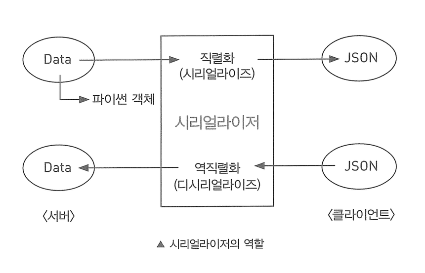
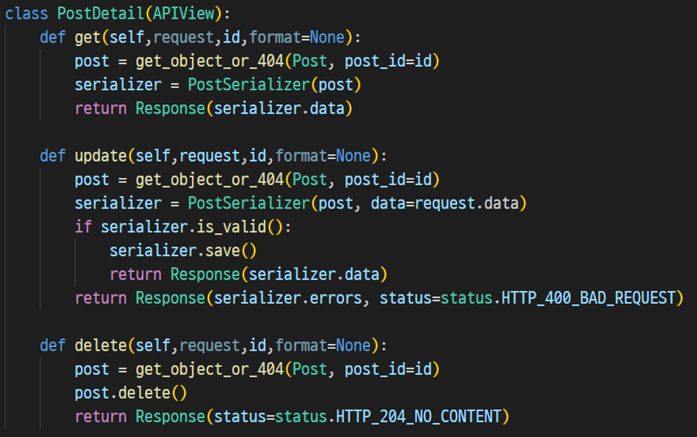

# 목차

# 배운 내용 정리

## DRF (Django Rest Framework)

Django 안에서 RESTful API 서버를 쉽게 만들 수 있도록 도와주는 오픈소스 라이브러리이다.

즉, DRF를 통해 Restful한 아키텍쳐를 HTTP method와 함께 사용하여 웹, 앱 데스크탑, 어플리케이션까지 범용 가능한 하나의 API를 제공할 수 있다.

DRF의 특징은 **Serializer**를 사용하고, FBV(Function Based View)가 아닌 **CBV(Class Based View)** 로 구현한다는 것이다.

### Serializer

Client와 Server API 간의 데이터 양식을 맞춰주는 변환기이다.

```python
def post_list(request):
			 
			  ... 
			  
	      ## Response에서 보일 데이터 내용을 Json 형태로 직접 재가공함.
        new_post_json = {
            "id": new_post.id,
            "writer": new_post.writer,
            "title" : new_post.title,
            "content": new_post.content,
            "category": new_post.category
        }

        return JsonResponse({
            'status': 200,
            'message': '게시글 생성 성공',
            'data': new_post_json
        })
```

Django에서는 데이터를 다룰 때 **QuerySet**의 형태로 데이터가 주어진다.

Django만 사용하는 풀스택 개발 환경에서는 별 상관이 없지만 Django가 Server만 담당하고 Client는 다른 시스템을 가진 개발 환경이라면 위의 코드와 같이 데이터 형식을 재가공하는 과정이 필요하다.

이런 과정을 일일이 하게 되면 매우 귀찮고 번거로울 것이므로, DRF에서는 **Serializer**를 사용하여 **직렬화 과정**을 통해 Model에서 꺼낸 데이터를 Queryset의 형태가 아니라 **json** 형태로 받아온다.

>💡 **DRF를 활용한 개발 순서는?**
>
> Django에서 개발 순서가 models.py → views.py → urls.py
>
> DRF에서는 models.py → **serializers.py** → views.py → urls.py

직렬화가 데이터를 json 형태로 변환하는 과정이라면, **역직렬화**는 반대로 json 형태를 데이터로 변환하는 과정이다.



### CBV (Class Based View)

기존에 쓰던 방식은 FBV(Function Based View)로, 함수로 view를 작성해 간편하고 직관적이지만 코드 확장과 재사용이 어렵다는 단점이 있었다.

CBV는 클래스로 view를 작성하여 클래스 내부에서 요청에 따라 함수를 재정의 하기 때문에 **일부 요청에만 데코레이터를 사용**할 수 있는 장점이 있어 DRF에서 많이 사용된다. 코드 확장과 재사용도 용이하다.



CBV는 다음과 같은 방법들로 구현이 가능하다.

1. APIView 활용
    - 자주 쓰이는 view 들을 패턴화하여 최소한의 코드로 구현하는 기본적인 클래스형 View이다.
    - 상속받은 클래스의 메서드를 구현하여 각 HTTP 메서드에 대한 처리로직을 구현한다.
    - 예시
        
        ```java
        class SnippetList(APIView):
            """
            List all snippets, or create a new snippet.
            """
            def get(self, request, format=None):
                snippets = Snippet.objects.all()
                serializer = SnippetSerializer(snippets, many=True)
                return Response(serializer.data)
        
            def post(self, request, format=None):
                serializer = SnippetSerializer(data=request.data)
                if serializer.is_valid():
                    serializer.save()
                    return Response(serializer.data, status=status.HTTP_201_CREATED)
                return Response(serializer.errors, status=status.HTTP_400_BAD_REQUEST)
        ```
        

1. Mixins 활용
    - APIView의 일반적인 로직들을 섞어 재사용성을 높였다.
    - `GenericAPIView` 와 다양한 mixin 클래스를 추가적으로 상속받아 구현한다.
    - 추가적으로 상속받은 클래스에 의해 내부 로직을 단순화시킬 수 있지만 그 영향으로 상속받아야 하는 클래스의 개수가 많은 편이다.
    - 예시
        
        ```java
        class SnippetList(mixins.ListModelMixin,
                          mixins.CreateModelMixin,
                          generics.GenericAPIView):
            queryset = Snippet.objects.all()
            serializer_class = SnippetSerializer
        
            def get(self, request, *args, **kwargs):
                return self.list(request, *args, **kwargs)
        
            def post(self, request, *args, **kwargs):
                return self.create(request, *args, **kwargs)
        ```
        

1. ViewSet 활용
    - View + Set = 뷰들의 집합
    - ViewSet은 CBV가 아닌 헬퍼클래스로 두 가지 종류가 존재한다.
        1. ReadOnlyModelViewSet: 목록 조회, 특정 레코드 조회
        2. ModelViewSet: 목록 조회, 특정 레코드 생성/조회/수정/삭제
    - 자체적인 구현을 가지고 있는 것이 아닌 Mixin을 적절히 상속받아 여러 기능을 수행한다.
    - 하나의 url에 다수의 클래스를 활용할 수 있게 된다.
    - 예시
        
        ```python
        class SnippetViewSet(viewsets.ModelViewSet):
            queryset = Snippet.objects.all()
            serializer_class = SnippetSerializer
            permission_classes = [permissions.IsAuthenticatedOrReadOnly,
                                  IsOwnerOrReadOnly]
        ```
        
>💡 **as_view()**
>
>- 클래스형 뷰에서는 path에 등록할 때 `.as_view()`를 사용함.
>- 심화
>    
>    클래스형 뷰는 클래스로 진입하기 위한 진입 메소드를 제공하는데, 이것이 `as_view()`메소드이며, 아래의 순서로 요청을 처리함.
>    
>    1. `as_view()` 메소드에서 클래스의 인스턴스를 생성한다.
>    2. 생성된 인스턴스의 `dispatch()` 메소드를 호출한다.
>    3. `dispatch()` 메소드는 요청을 검사해서 HTTP의 메소드(GET, POST)를 알아낸다.
>    4. 인스턴스 내에 해당 이름을 갖는 메소드로 요청을 중계한다.
>    5. 해당 메소드가 정의되어 있지 않으면,  `HttpResponseNotAllowed` 예외를 발생시킨다.

# 후기

기존의 메서드 위주의 View보다 활용성 높은 DRF 라는 것을 배웠다.

json 형태로 일일이 재구성하여 Response를 만들지 않아도 된다는 것이 정말 큰 편리함으로 다가왔다. 물론 구현의 자유도는 기존보다 낮아지겠지만, 상황에 맞추어 다양한 Mixin 클래스를 이용한다면 그런 단점을 상쇄시킬 수 있다는 생각이 들었다.

이번 과제는 기존에 만들었던 Post나 Comment의 View를 CBV로 재구성하는 것이었는데, 그러다 보니 구조가 단순해서 CBV의 장점들을 많이 활용하지 못했던 것 같다. 다음 과제에는 좀 더 복잡한 model을 만들어 CBV의 여러 형태를 체험해보고 싶다.