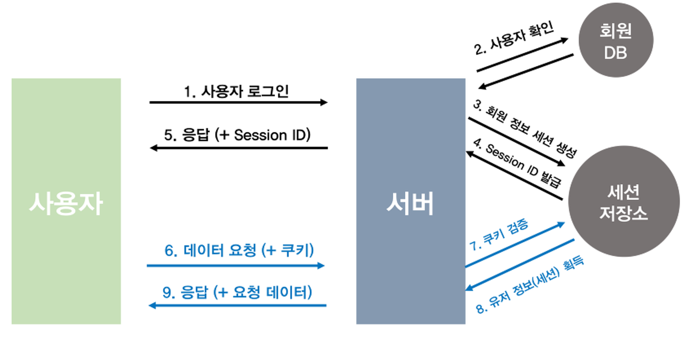
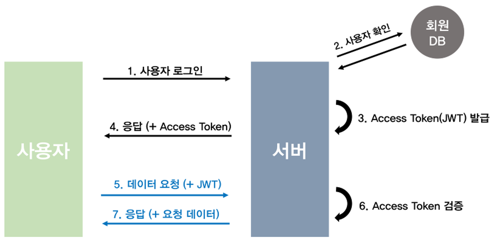
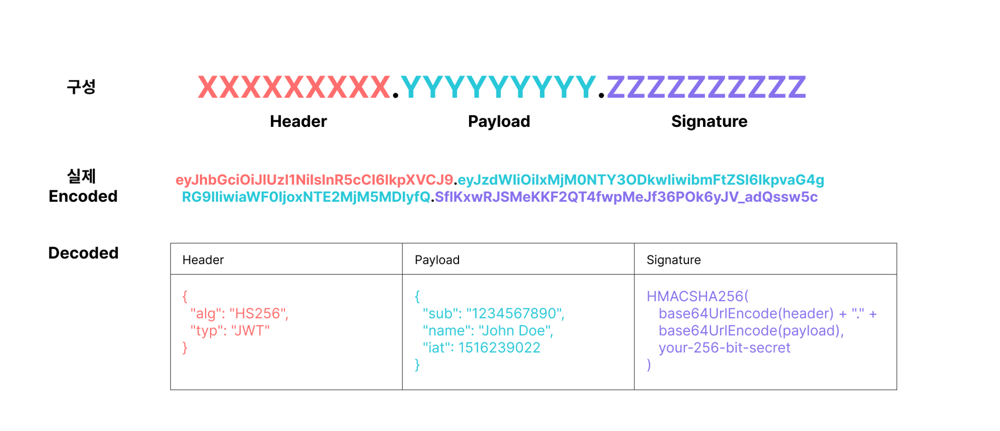
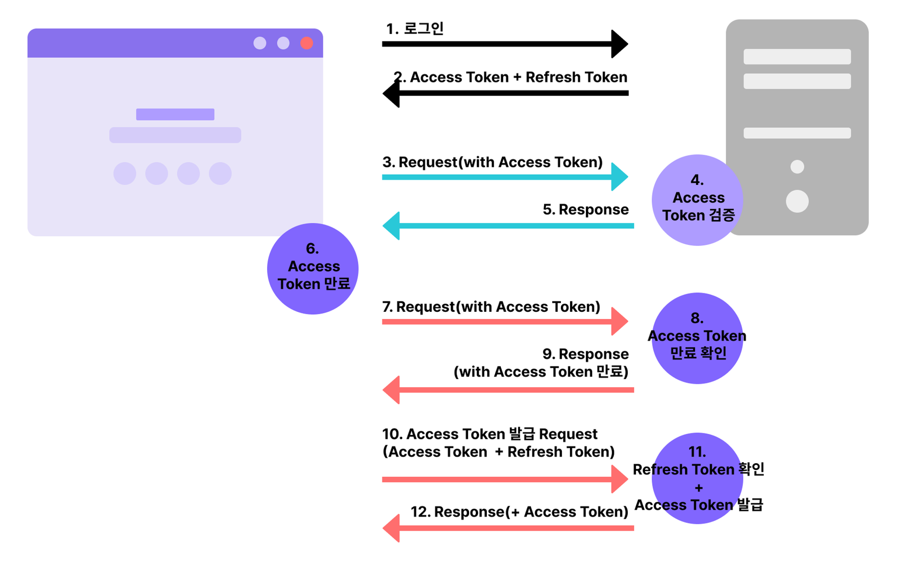

# 목차

# 배운 내용 정리

## 인증

인증(Authentication) : 사용자의 **신원을 검증**하는 것

서비스의 인증 과정
1. DB에 회원의 정보를 저장한다
2. 비밀번호와 같은 입력값으로 본인이 맞는지 검증한다

회원가입 로직
1. 입력한 아이디가 DB에 있는지 확인한다
2. 없을 경우 입력한 아이디와 비밀번호로 사용자 정보를 생성한다
3. 생성한 정보를 DB에 저장한다

로그인 로직
1. 입력한 아이디와 비밀번호를 DB에 저장된 정보와 비교한다
2. 일치하면 인증 성공
    1. HTTP 200 OK
3. 일치하지 않으면 인증 실패
    1. HTTP 401 Unauthorized
    2. HTTP 403 Forbidden
    

비밀번호는 DB에 평문으로 저장하면 **절대** 안된다!

아래와 같은 추가적인 작업이 필요하다

1. 비밀번호를 **안전하게 저장**하기
2. 클라이언트 요청 시 사용자 정보를 **안전하게 담아 전달**하기
3. 로그인 이후, 매번 **아이디와 비밀번호를 담아 요청하지 않고도 사용자의 신원이 검증된 요청**임을 알 수 있도록 하기

### 세션 기반 인증 방식



- 클라이언트가 가지고 있는 건 세션 ID뿐
    - 세션 ID에는 사용자 정보가 담겨있지 않아서 세션 ID가 노출되어도 사용자 정보 노출 안됨
- 서버는 세션을 메모리 혹은 데이터베이스에 저장하는데, 로그인한 사용자가 늘어나면 부하가 일어난다
- 또한 서버를 확장할 때 세션 분산 시스템을 설계해야 하기 때문에 서비스 규모를 확장하기 어려워진다

### 토큰 기반 인증 방식



- 세션 저장소가 필요 없어진다
- 서버의 확장성이 높아지고 대량의 트래픽에도 대처 가능하다
- 토큰에 모든 정보들이 들어가 있어 데이터 누출에 취약하다

## jwt

JWT는 인증과 인가에 일반적으로 사용되는 **토큰**의 일종이다.

인증에 필요한 **사용자 정보를 암호화**하여 자체적으로 포함한다는 특징이 있다.

JWT는 기본적인 사용자 정보뿐만 아니라 암호화된 **서명(Signature)** 을 포함하고 있어 무결성도 검증할 수 있다. 또한 JSON 형태의 사용자 데이터를 URL에 대해 안전한 문자열(Base64 URL-safe Encode)로 인코딩했기 때문에 어떤 경로로든 전송할 수 있다.

인증에 필요한 정보들이 토큰 자체에 포함되어 있기 때문에 클라이언트가 HTTP 요청 헤더에 담긴 토큰만으로 인증/인가 작업을 수행할 수 있지만, 토큰 길이가 매우 길어진다.

앞서 설명한 내용 중 세션 기반 방식은 **state-ful**, 토큰 기반 방식은 **state-less**라고 말한다.

세션 기반 방식의 state-ful
- 웹서버가 사용자의 상태 정보를 기억하고 있다가 유용한 정보로 활용한다.
- 서버에서 클라이언트세션을 유지할 필요가 없을때 서버 리소스를 절약하는 장점이 있다.

토큰 기반 방식의 state-less
- 무상태
    - 서버 클라이언트 구조에서 서버가 클라이언트의 상태를 가지고 있지 않는다.
    - 통신이 끝나면 더 이상 상태를 유지하지 않는다.
- 장점
    - 서버의 확장성이 높다.
    - 대량의 트래픽이 발생해도 대처할 수 있다.
- 단점
    - 페이지를 이동할때마다 이전의 로그인이 유효하지 않아서 매번 로그인을 다시 해야한다.
    - 이 창 다시 열지 않기 를 눌러도 계속 팝업이 뜬다.
    - state-ful 방식보다 비교적 많은 양의 데이터가 반복적으로 전송되기 때문에 네트워크 성능저하가 될 수 있다.
    - 데이터 노출로 인한 보안적인 문제. ⇒ **이를 보완하기 위해 데이터를 압축/암호화 하기 위하여 jwt를 사용**
    

HTTP는 state-less를 지향하기 때문에, 웹 프로젝트에서는 주로 state-less 특징을 가진 jwt가 많이 사용된다.

### jwt 구조



- 헤더 : 토큰의 타입과 서명(Signature)에 사용되는 암호화 알고리즘에 대한 정보를 담고 있다.
- 인증에 필요한 사용자 정보나 데이터 속성을 포함하는 부분이다. **클레임**이라는 `<name>:<value>` 형태의 정보 단위로 구성되어 있다.
- 서명 : base64로 인코딩된 헤더와 페이로드, 그리고 비밀키를 이용하여 암호화된 값이다.
    - 헤더나 페이로드의 변조 여부를 확인하여 무결성을 검증하고 보장하는 데 사용된다. 쉽게 말하면, 공격자가 페이로드의 내용을 악의적으로 바꾸었을 때 서명을 확인하면 토큰의 유효성을 판단할 수 있다.

### jwt 장점

- 데이터의 위변조를 방지한다.
- JWT는 인증에 필요한 모든 정보를 담고 있기 때문에 인증을 위한 별도의 저장소가 없어도 된다.
- 세션(Stateful)과 다르게 서버는 무상태(StateLess)가 된다.
- 확장성이 우수하다.
- OAuth의 경우 소셜 계정을 통해서 다른 웹서비스에 로그인 할 수 있다.

### jwt 단점

- base64인코딩을 통한 정보전달→ 전달량 많음 → 네트워크 전달시 많은 데이터량으로 부하 가능성
- payload는 암호화 되어있지 않다 ⇒ 민감한 정보 저장 X
- 토큰이 탈취당하면 만료될때까지 대처 불가능

### jwt를 이용한 인증 과정



1. 클라이언트에서 사용자가 로그인하기 위해 입력한 ID와 PW를 서버에 보낸다.
2. 서버는 ID와 PW를 회원 DB에서 확인한다.
3. 회원 정보가 존재하면 JWT를 생성하여 클라이언트에 응답한다. 이때 Access Token과 Refresh Token을 같이 전달한다.
4. 이후 클라이언트는 요청할 때마다 HTTP 헤더에 Access Token을 담아 보낸다.
5. 서버는 Access Token을 검증힌다.
    1. 헤더에 담긴 토큰을 복호화해보면 이 사용자가 누구인지 확인할 수 있다.
6. 검증이 완료되면 응답을 보낸다.

이때 Access Token은 탈취당할 가능성이 있으므로 보안을 위해 Access Token의 유효시간을 최대한 짧게 해주는 것이 보통이다.

유효기간을 짧게 만든다는 것은 그만큼 로그인 주기도 짧아진다는 것이므로 사용자가 피곤해진다.

따라서 **Refresh Token**이라는 개념을 추가해 이 문제를 해결한다.

Refresh Token은 Access Token이 만료되었을 때 새로 발급할 수 있도록 해주는 열쇠이다. Access Token보다 유효기간이 길지만 Access Token이 만료 되었을 때만 서버로 전송되기 때문에 탈취당할 위험이 적다. 

아래는 Refresh Token이 사용되는 과정이다.

1. 서버가 데이터와 함께 온 Access Token이 만료되었음을 확인한다.
2. 서버는 클라이언트에 Access Token이 만료되었음을 알려주는 응답을 보낸다.
3. 클라이언트가 Access Token과 Refresh Token을 같이 담아 재발급 요청을 보낸다.
4. 서버는 Refresh Token을 확인한 후 Access Token을 재발급한다.
5. 서버는 클라이언트에 재발급한 Access Token과 함께 응답을 보낸다.

## Django의 Permission

Django에서는 아래와 같은 기본 Permission으로 인증/인가를 다룬다.

| permission | 설명 |
| --- | --- |
| AllowAny | 접근에 제한이 없어, 로그인 여부와 관계없이 모든 요청을 허용함 |
| IsAuthenticated | 로그인한 사용자에 대해서만 해당 요청을 허용함 |
| IsAuthenticatedOrReadOnly | 로그인한 사용자에게는 모든 요청을 허용함. 인증되지 않은(로그인하지 않은) 요청에 대해서는 읽기 권한만 허용함 |
| IsAdminUser | 로그인한 사용자가 staff인 요청만 허용함 |
| DjangoModelPermissions | 인증된 요청에 한하여 뷰 호출을 허용하고, 추가로 장고 모델단위 Permissions 체크함 |
| DjangoModelPermissionsOrAnonReadOnly | DjangoModelPermissions와 유사하나, 비인증 요청에게는 읽기만 허용함 |
| DjangoObjectPermissions | 비인증 요청을 거부하며, 인증된 요청은 Object에 대한 권한 체크를 수행함 |

또는 **custom permission**으로 원하는 Permission을 만들 수도 있다. 일반적으로  `config/permissions.py`에 정의한다.

```python
# ../permissions.py
from rest_framework.permissions import BasePermission

class IsOwner(BasePermission):
      """게시물 작성자만 접근 가능하게 하기"""
    def has_object_permission(self, request, view, obj):
          if request.user.is_authenticated:
              if request.user == obj.user:
                  return True
            return False
        else:
              return False
```

```python
@api_view(['POST', 'GET'])
@permission_classes([IsOwner])
def index(request):
      pass
```

# 후기

이번 세션에서 Python의 `is None` 과 `== None` 은 어떤 차이가 있을까라는 질문이 주어졌는데, 알아보니 **대부분의 경우**에서 둘의 차이는 존재하지 않고 커스텀 비교 연산자인 `__eq__` 함수를 사용할 때 그 차이가 보여진다고 한다.

그 이유는 `is None` 은 객체 자체를 비교하고, `== None` 은 객체의 요소를 비교하는 차이점 때문이라고 한다. 그리고 `is None` 이 `== None` 보다 약 50% 정도 빠른 속도를 보여주고 (사실 큰 차이는 아니다), 파이썬 코딩 컨벤션인 PEP8 스타일에서도 `is None` 을 더 권장하고 있다는 소소한 정보가 있었다.

이번 과제에서는 Permission을 이용했는데, `has_object_permission` 으로 게시글의 작성자를 가져와 현재 사용자와 비교하는 것을 구현하려 했는데 `APIView` 에서는 `has_object_permission` 을 호출하지 않는다는 것을 알게 되었다. 그래서 부득이하게 Post의 View들을 `APIView` 에서 `RetrieveUpdateDestroyAPIView` 로 구조를 변경하게 되었다. Challenge 과제는 아이디어톤 스케쥴이 너무 살인적인 나머지 하지 못했다… 다만 아이디어톤이 끝나면 바로 도전해볼 생각이다.

---

이번 세션으로 이제 로그인과 로그아웃 기능을 구현할 수 있게 되었다! 대부분의 웹 서비스는 회원 기능이 없는 경우가 거의 없으므로 이번에 배운 **jwt 인증/인가**는 정말 중요한 기능이라고 생각한다.

다만 요즘 웹 서비스의 추세는 ID-Password 형식의 기본적인 로그인에서 벗어나 OAuth를 많이 기용하기 시작했고, 최근 출시되는 서비스들은 하나같이 다 OAuth로만 로그인이 가능하게 만들어진다는 이야기를 들었다.
나도 계정 정보를 DB에 저장하기 보다는 이미 접근성이 높은 서비스들의 계정으로 로그인하는 것이 사용자에게도, 서버에게도 좋은 선택이라고 생각한다.

빨리 다음 세션에서 OAuth에 대해 배우고 진정한 웹 서비스를 구축해보고 싶다!